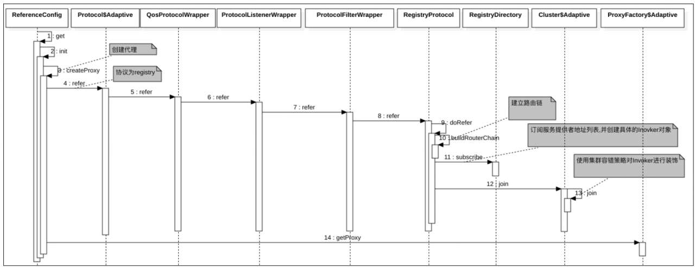

##Directory目录与Router路由服务
Directory代表了多个invoker（对于消费端来说，每个invoker代表了一个服务提供者），其内部维护着一个List，并且这个List的内容是动态变化的，比如当服务提供者集群新增或者减少机器时，服务注册中心就会推送当前服务提供者的地址列表，然后Directory中的List就会根据服务提供者地址列表相应变化。

在Dubbo中，接口Directory的实现有RegistryDirectory和StaticDirectory两种，其中前者管理的invoker列表是根据服务注册中心的推送变化而变化的，而后者是当消费端使用了多注册中心时，其把所有服务注册中心的invoker列表汇集到一个invoker列表中。

###RegistryDirectory的创建流程：

通过上图可知RegistryDirectory是在服务消费端启动时创建的。

ReferenceConfig代表一个要消费的服务的配置对象，调用ReferenceConfig的get（）方法，就意味着要创建一个对服务提供方的远程调用代理。

· 在上图中，步骤2在创建对远程服务提供者的代理时，第一步是调用RegistryProtocol类的refer（）方法，由于RegistryProtocol是一个SPI，所以这里是通过其适配器类Protocol$Adaptive进行间接调用的。另外，这里的ProtocolListenerWrapper、QosProtocolWrapper和ProtocolFilterWrapper是对RegistryProtocol类的功能的增强。

###RegistryDirectory中invoker列表的更新：
通过图可知，创建完RegistryDirectory后，调用了其subscribe（）方法，这里假设使用的服务注册中心为ZooKeeper，这样就会去ZooKeeper订阅需要调用的服务提供者的地址列表，然后步骤3添加了一个监听器，当ZooKeeper服务端发现服务提供者地址列表发生变化后，会将地址列表推送到服务消费端，然后zkClient会回调该监听器的notify（）方法。

在步骤3设置完监听器后，同步返回了订阅的服务地址列表、路由规则、配置信息等，然后同步调用了RegistryDirectory的notify（）方法：

步骤6从ZooKeeper返回的服务提供者的信息里获取对应的路由规则，并使用步骤7保存到RouterChain里，这个路由规则是通过管理控制台进行配置的。

步骤9根据服务降级信息，重写URL（也就是把mock=return null等信息拼接到URL中）并保存到overrideDirectoryUrl中，然后执行步骤10，把服务提供者的URL列表转换为invoker列表，并保存到RouterChain里：

另外，RouterChain里也保存了可用服务提供者对应的invokers列表和路由规则信息，当服务消费方的集群容错策略要获取可用服务提供者对应的invoker列表时，会调用RouterChain的route（）方法，其内部根据路由规则信息和invokers列表来提供服务，流程如图4.4所示

总结一下就是，在服务消费端应用中，每个需要消费的服务都被包装为ReferenceConfig，在应用启动时会调用每个服务对应的ReferenceConfig的get（）方法，然后会为每个服务创建一个自己的RegistryDirectory对象，每个RegistryDirectory管理该服务提供者的地址列表、路由规则、动态配置等信息，当服务提供者的信息发生变化时，RegistryDirectory会动态地得到变化通知，并自动更新。

至于RouterChain链是什么时候创建的，我们已经在3.3节提到过，即RouterChain链是在消费端启动过程中通过RegistryProtocol的doRefer（）方法调用RegistryDirectory的buildRouterChain（）方法创建的。