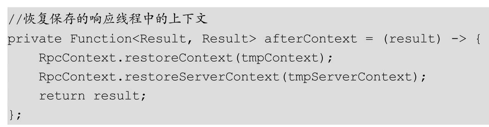

#Dubbo全链路异步
##服务消费端异步调用
正如Dubbo官网所介绍的，从2.7.0版本开始，Dubbo以CompletableFuture为基础支持所有异步编程接口，解决了2.7.0之前的版本异步调用的不便与功能缺失。

异步调用是基于NIO的非阻塞能力实现并行调用，
**服务消费端不需要启动多线程即可完成并行调用多个远程服务，相对多线程开销较小**。图11.1显示的是Dubbo异步调用链路的流程图：

图11.1中的步骤1是当服务消费端发起RPC调用时使用的用户线程，用户线程首先使用步骤2创建一个Future对象，接着步骤3会把请求转换为I/O线程来执行，步骤3为异步过程，所以会马上返回，然后用户线程使用步骤4把其创建的Future对象设置到RpcContext中，其后用户线程就返回了。

在步骤5中，用户线程可以在某个时间点从RpcContext中获取设置的Future对象，并且使用步骤6来等待调用结果。

在步骤7中，当服务提供方返回结果后，调用方线程模型中的线程池中的线程则会把结果使用步骤8写入Future，这时用户线程就可以得到远程调用结果了。

图中的实线箭头代表同步调用，虚线箭头表示异步调用。

###2.7.0版本前的异步调用实现
2.7.0版本之前的异步调用能力比较弱，比如在基础篇介绍的APiAsyncConsumer类里使用下面的方式进行异步调用：

代码2设置调用为异步方式，代码3直接调用sayHello（）方法会马上返回null。如果要想获取远程调用的真正结果，需要使用代码4获取future对象，并且调用future的get（）系列方法来获取真正的结果，下面我们看看这种方式是如何实现的：

在3.4节我们讲到，具体发起远程调用是在DubboInvoker的doInvoke（）方法内，其中会区分是否为异步调用：

如果发现是异步调用，代码1.6会调用currentClient.request（inv，timeout）执行远程调用，该调用不会阻塞，而是马上返回一个future对象，返回的future对象会被适配器类FutureAdapter做包装，接着把包装结果设置到RpcContext里，然后返回SimpleAsyncRpcResult，SimpleAsyncRpcResult的构造函数保存了上下文对象（这在后面会具体用到）：

另外，由于SimpleAsyncRpcResult的recreate（）方法的代码如下：

其内部会返回null。

为了探究2.7.0版本之前的异步调用的实现原理，我们需要看看代码1.6.1内到底做了什么。其中，currentClient是ReferenceCountExchangeClient的实例，我们首先看看如图11.2所示的时序图：

通过图11.2可知，代码1.6.1最终调用了HeaderExchangeChannel的request（）方法，其代码如下：

代码2创建了请求对象，然后代码3创建了一个future对象，代码4使用底层通信异步发送请求（使用Netty的I/O线程把请求写入远端）。因代码4是非阻塞的，所以会马上返回。

这里简单提一下，从用户线程发起远程调用到返回request，使用的都是用户线程。由于代码4 channel.send（req）会马上返回，所以不会阻塞用户线程。

为了探究异步实现，我们需要看看代码3中的DefaultFuture，其类图如图11.3所示：

从图11.3可以看到，DefaultFuture中有3个静态变量：

由于是static变量，所以全部DefaultFuture实例共享这3个变量。

图11.3中的lock是一个独占锁，done是该锁的一个条件变量：

lock和done是为了实现线程之间的通知等待模型，比如调用DefaultFuture的get（）方法的线程为了获取响应结果，内部会调用done.await（）方法挂起调用线程。当接收到响应结果后，调用方线程模型中线程池里的线程会调用received（）方法，其内部会把响应结果设置到DefaultFuture内，然后调用done的signal（）方法激活一个因调用done的await（）系列方法而挂起的线程（比如调用get（）方法被阻塞的线程）。

首先我们看看代码3是如何使用newFuture创建DefaultFuture对象的：

其中，DefaultFuture构造函数如下：

DefaultFuture内部保存了请求的信息，包含请求ID、请求通道、请求内容、超时时间，并且把当前DefaultFuture对象保存到缓存中，通道也保存到缓存中，缓存的key为请求ID。

代码5创建完DefaultFuture后，代码6检查超时情况，其代码如下：

代码6.1创建了一个可执行任务，代码6.2则当设置的超时时间到了之后执行创建的任务，在任务内会检查调用是否已经完成，具体代码如下：

当超时时间到了之后，上面的代码会检查任务是否已经完成，如果已经完成则直接返回，否则创建超时事件，并调用DefaultFuture.received把结果设置到future内。

到这里我们就讲完了newFuture（）方法的作用，具体来说就是创建一个DefaultFuture对象，并启动一个定时器，然后在超时时间后检查是否已经有响应结果，如果有则直接返回，否则返回超时信息。

下面我们看看received（Channel channel，Response response）方法：

从上面的代码可知，当发起的请求的结果返回时或者超时时间到了之后，会调用received（）方法，其中代码7把请求ID对应的future从缓存中移除，然后调用doReceived（）方法把响应结果设置到DefaultFuture的结果变量response中：

在上面的代码中，doReceived（）方法会把响应结果设置到response变量里，然后激活一个由于调用done的wait（）方法被阻塞的线程（比如由于调用了get（）系列方法导致线程阻塞的线程）。另外，如果在future上设置了回调，则会调用回调函数。

获取执行结果的get（）方法如下：

在上面的代码中，如果超时时间＜=0，则使用默认值1000；如果任务还没完成（响应结果还是为null），则调用条件变量done的await（）方法，让当前线程挂起timeout时间——若在timeout时间内得到了响应结果（也就是说received（）方法被调用了），则当前线程会被激活；如果已经得到响应结果，则直接执行代码14返回结果。

简单总结一下：本节一开始讲解了Dubbo异步调用链路流程图，当服务消费端业务线程发起请求后，会创建一个DefaultFuture对象并设置到RpcContext中，然后在启动I/O线程发起请求后调用线程就返回了null的结果；当业务线程从RpcContext获取future对象并调用其get（）方法获取真实的响应结果后，当前线程会调用条件变量done的await（）方法而挂起；当服务提供端把结果写回调用方之后，调用方线程模型中线程池里的线程会把结果写入DefaultFuture对象内的结果变量中，接着调用条件变量的signal（）方法来激活业务线程，然后业务线程就会从get（）方法返回响应结果。

这里所讲的这种实现异步调用的方式基于从返回的future调用get（）方法，其缺点是，当业务线程调用get（）方法后业务线程会被阻塞，这不是我们想要的，所以Dubbo提供了在future对象上设置回调函数的方式，让我们实现真正的异步调用。先看看在基础篇中介绍的APiAsyncConsumerForCallBack类：

通过上面的代码可知，这种方式在业务线程获取了future对象后，在其上设置回调函数后马上就会返回，接着等服务提供端把响应结果写回调用方，然后调用方线程模型中线程池里的线程会把结果写入future对象，其后对回调函数进行回调。由此可知，这个过程中是不需要业务线程干预的，实现了真正的异步调用。

下面我们看看回调函数的异步方式具体是如何实现的。在代码1.6.1中，在发起远程调用后，把返回的future对象使用FutureAdapter进行了包装，通过RpcContext.getContext（）.getFuture（）获取的其实就是FutureAdapter对象，调用FutureAdapter的getFuture（）方法获取的其实就是DefaultFuture对象，所以代码17是把回调函数设置到了DefaultFuture内，下面我们看看setCallback（）方法：

在上面的代码中，如果当前任务已经完成则直接执行回调，否则设置回调并等有响应结果时再执行回调。

其中，invokeCallback（）方法的代码为：

另外，回顾一下前面所讲的doReceived（）方法内的代码10，可知当接收到响应结果后，如果发现回调函数不为null，则也会调用invokeCallback（）方法。

上面我们介绍了2.7.0版本之前提供的异步调用方式，Future方式只支持阻塞式的get（）接口获取结果。虽然通过获取内置的ResponseFuture接口，可以设置回调，但获取ResponseFuture的API使用起来很不便，并且无法满足让多个Future协同工作的场景，功能比较单一。

###2.7.0版本提供的异步调用实现
在基础篇中介绍的APiAsyncConsumerForCompletableFuture2类使用了Dubbo 2.7.0版本提供的基于CompletableFuture的异步调用：

代码4可以直接获取到CompletableFuture，然后设置回调，基于CompletableFuture已有的能力，我们可以对CompletableFuture对象进行一系列的操作，以及可以让多个请求的CompletableFuture对象之间进行运算（比如合并两个CompletableFuture对象的结果为一个CompletableFuture对象等）。

下面我们看看这是如何实现的，首先看看RpcContext.getContext（）.getCompletableFuture（）到底返回的是什么：

从上面的代码可知，返回的还是FutureAdapter对象，所以我们还要回到FutureAdapter类，该类继承了CompletableFuture类。我们需要看看FutureAdapter类是如何将DefaultFuture转换到CompletableFuture的，为此先看看FutureAdapter的构造函数：

从上面的代码可知，FutureAdapter继承自CompletableFuture，代码6对传递的DefaultFuture设置回调（在2.7.0版本前，基于回调的异步调用需要我们自己设置回调，为了让CompletableFuture适配上DefaultFuture，专门内建一个回调）。然后，在回调方法的done（）内，把结果写入FutureAdapter继承的CompletableFuture内。

简单总结一下：当业务线程发起远程调用时，会创建一个DefaultFuture实例，接着经过FutureAdapter把DefaultFuture转换为CompletableFuture实例，然后把CompletableFuture实例设置到RpcContext内。业务线程从RpcContext获取该CompletableFuture后，设置业务回调函数。

当服务提供方把结果写回调用方之后，调用方的线程模型中线程池里的线程会调用DefaultFuture的received（）方法，并把响应结果写入DefaultFuture，接着调用这里的代码6所设置的回调，回调内部的done（）方法再把结果写入CompletableFuture，然后CompletableFuture会调用业务设置的业务回调函数。

##服务提供端异步执行
在Provider端非异步执行时，对调用方发来的请求的处理是在Dubbo内部线程模型的线程池里的线程中执行的（参见第7章和3.2节）。在Dubbo中，服务提供方提供的所有服务接口都是使用这一个线程池来执行的，所以当一个服务执行比较耗时时，可能会占用线程池中很多线程，从而导致其他服务的处理收到影响。

Provider端异步执行则将服务的处理逻辑从Dubbo内部线程池切换到业务自定义线程，避免Dubbo线程池中的线程被过度占用，有助于避免不同服务间的互相影响。

但需要注意的是，Provider端异步执行对节省资源和提升RPC响应性能是没有效果的，这是因为如果服务处理比较耗时，虽然不是使用Dubbo框架内部线程处理，但还是需要业务自己的线程来处理，另外还有副作用，即会新增一次线程上下文切换（从Dubbo内部线程池线程切换到业务线程），模型如图11.4所示：

从图11.4可知，Provider端在同步提供服务时是使用Dubbo内部线程池中的线程来进行处理的，在异步执行时则是使用业务自己设置的线程从Dubbo内部线程池中的线程接收请求进行处理的。

##基于定义CompletableFuture签名的接口实现异步执行
在基础篇的Demo中，GrettingServiceAsyncImpl中的服务提供端实现了基于定义CompletableFuture签名的接口实现异步执行：

通过上面的代码可知，基于定义CompletableFuture签名的接口实现异步执行需要接口方法的返回值为CompletableFuture，并且方法内部使用CompletableFuture.supplyAsync让本来该由Dubbo内部线程池中的线程处理的服务，转换为由业务自定义线程池中的线程来处理，CompletableFuture.supplyAsync（）方法会马上返回一个CompletableFuture对象（所以Dubbo内部线程池中的线程会得到及时释放），传递的业务函数则由业务线程池bizThreadpool执行。

需要注意的是，调用sayHello（）方法的线程是Dubbo线程模型线程池中的线程，而业务处理是由bizThreadpool中的线程来处理的，所以代码2.1保存了RPC上下文对象，以便在业务处理线程中使用。

在3.4节我们提到，当消费端发起远程调用时，请求会被InvokerInvocationHandler拦截，并在其中创建RpcInvocation，并且如果调用方法的返回值为CompletableFuture或者其子类，则会把future_returntype为true和async=true的属性添加到RpcInvocation的附加属性Map中。

在3.1节讲到，在Dubbo内部线程池中的线程接收received请求后，当请求被处理时，如果发现请求是需要返回值的，则会调用HeaderExchangeHandler的handleRequest（）方法，其代码如下：

在上面的代码中，代码3执行的handler.reply的代码为：

其中，代码3.1最终会调用AbstractProxyInvoker的invoke（）方法：

从上面的代码可知，返回结果是CompletableFuture类型，或者使用RpcContext.startAsync（）方法开启异步执行，返回AsyncRpcResult。

在代码3.2中，如果发现结果为AsyncRpcResult，则说明是服务提供方的异步执行，此时返回CompletableFuture对象，否则为同步执行，并把结果转换为CompletableFuture对象（同步转异步）。所以，代码3返回的肯定是CompletableFuture对象，无论是同步执行还是异步执行。

在接收到CompletableFuture对象后，代码3判断请求处理是否完成。如果请求已经完成，则执行代码4来设置结果并写回到调用方，否则执行代码5，即调用CompletableFuture来设置一个回调，等请求处理完毕后使用业务自己设置的线程池来执行回调，在回调函数内把结果或者错误信息写回调用方。

##使用AsyncContext实现异步执行
在基础篇的Demo中，GrettingServiceAsyncContextImpl使用了AsyncContext实现异步执行，代码如下：

代码2.1调用RpcContext.startAsync（）方法开启服务异步执行，然后返回一个asyncContext，然后把服务处理任务提交到业务线程池后该方法就直接返回了null。在异步任务内，首先执行代码2.2切换任务的上下文，然后休眠500ms充当任务执行，最后代码2.3把任务执行结果写入异步上下文，其实现是参考了Servlet 3.0的异步执行。

在这里，由于具体执行业务处理的逻辑不在sayHello（）方法所在的Dubbo内部线程池的线程中，所以不会被阻塞。

为了探究其原理，我们先看看RpcContext.startAsync（）方法：

上面这些代码的主要作用是为当前调用线程关联的RPC上下文对象关联AsyncContextImpl。AsyncContextImpl构造函数如下：

这里把当前线程上下文对象保存到了AsyncContextImpl内部（这是因为ThreadLocal变量不能跨线程访问，可以参考《Java并发编程之美》一书）。

AsyncContextImpl创建完毕后会被启动，其中AsyncContextImpl的start（）方法为：

通过上面的代码可知，这里是为AsyncContextImpl内的future对象创建一个CompletableFuture对象，其中started是原子性boolean变量，为的是避免重复创建CompletableFuture。

下面我们看看AsyncContextImpl的signalContextSwitch（）方法，该方法用来将保存在AsyncContextImpl内的上下文信息传递到业务线程池的线程中（也就是说业务线程池中的线程可以通过RpcContext来访问）：

需要注意的是，signalContextSwitch（）方法需要放在业务线程中的第一句来执行，以避免后面的业务处理使用RpcContext获取上下文信息时出错。

下面我们再看看AsyncContextImpl的write（）方法

在上面的代码中，当业务线程中的服务处理完毕，会把执行结果写入start（）方法创建的CompletableFuture对象内。

简单总结一下：当Dubbo线程模型线程池中的线程执行sayHello（）方法时，在方法内通过RpcContext.startAsync（）创建一个AsyncContextImpl实例，接着调用其start（）方法创建一个CompletableFuture对象。然后，在sayHello（）方法把业务处理任务添加到线程池之后，直接返回null。接着，在返回null后，结合上一节在AbstractProxyInvoker的invoke（）方法内代码6.1也返回了null，然后代码6.2通过判断返回结果用RpcContext.startAsync（）开启异步执行，所以使用（（AsyncContextImpl）（rpcContext.getAsyncContext（）））.getInternalFuture（）获取AsyncContextImpl内的future对象，该future对象会被返回给上一节的代码3.1，然后代码3.2把future返回给上一节的代码3，后面的逻辑就与上一节一样了。

##异步调用与执行引入的新问题
**Filter链**

在2.7.0版本之前，在消费端采用异步调用后，由于异步结果在异步线程（Dubbo框架线程模型线程池中的线程）中单独执行，因此DubboInvoker的invoke（）方法在发起远端请求后，会将空的RpcResult对象返回Filter调用链，也就是说，Filter链上的所有Filter获取的远端调用结果都是null，最终null值也直接返回给调用方法。而真正的远端调用结果需要调用方从RpcContext获取future对象来获取，当真正远端结果返回时，已经不会再次走Filter链进行处理了。

在2.7.0版本之前，异步调用时序图如图11.5所示

从图11.5可知，在2.7.0版本之前，服务消费端的调用在发起远程调用DubboInvoker的invoke（）方法前进入Filter链，如果是异步调用，则DubboInvoker的invoke（）方法会创建一个DefaultFuture对象并设置到RpcContext中，接着返回一个空的RpcResult，然后该RpcResult会一层层返回到Filter链中的Filter，最终返回到业务调用的sayHello（）方法，得到结果null。

当调用方要获取真正的响应结果时，则需要首先从RpcContext获取future对象，然后调用其get（）方法进行等待。当服务提供方把服务处理结果写回调用方后，调用方I/O处理线程会把结果传递给调用方线程模型中的线程，从而把结果写入future对象，接着调用方线程就会从future的get（）方法返回，以获取真正的执行结果。可以看到，当真正结果回来时并没有再次执行Filter链。

为了解决这个问题，在2.7.0版本中为Filter接口增加了回调接口onResponse：

由此可知，所有实现了Filter扩展接口的实现类都会含有这个默认的onResponse（）方法，并且默认返回传递过来的result。如果有需要的话，实现类可以重写onResponse（）方法，比如FutureFilter:

在2.7.0版本中，在异步调用后，DubboInvoker的invoke（）方法返回的是SimpleAsyncRpcResult对象而不再是RpcResult，前者继承了AsyncRpcResult类，并且其中含有远程调用返回的DefaultFuture。

前面我们讲到，Filter链是在ProtocolFilterWrapper的buildInvokerChain（）方法中建立并使用Invoker串联的。在2.7.0版本之前，Invoker的invoke（）方法如下：

由上面的代码可知，Filter链中的前一个Filter的结果会直接返回给后一个，而在2.7.0版本中，其代码被修改如下:

在Dubbo 2.7.0中，消费端同步调用会执行代码2，同步调用对应Filter的onResponse（）方法。异步调用则会执行代码1，上面提到了这里的result实际上是SimpleAsyncRpcResult，下面我们看看它的thenApplyWithContext（）方法：

这里的resultFuture就是DubboInvoker中的invoke（）方法在执行异步调用返回后创建的FutureAdapter中的resultFuture，它是CompletableFuture对象。

其中，函数指针beforeContext的定义为：

其中，函数指针afterContext的定义为:

thenApplyWithContext（）函数的作用是等得到响应结果后首先执行beforeContext（）函数，以恢复发起远程调用时线程对应的上下文对象，并保存响应线程对应的上下文对象，然后执行传递的fn（）方法，也就是执行filter.onResponse（r，invoker，invocation）来调用当前Filter的onResponse（）方法，最后再调用afterContext（），以恢复保存的响应线程中的上下文。

另外，上面的FutureFilter也是同样的逻辑。经过上面的改造后，异步调用流程是这样的：当服务提供端把结果写回调用方后，调用方的线程模型中的线程会把结果写入CompletableFuture对象，接着Filter链中的Filter会执行自己的onResponse（）方法，然后把结果以新的CompletableFuture对象形式返回给Filter链上的一个节点，最后把最终结果写入业务调用方调用的get（）方法的future对象内，这样就获得最终调用结果了。

同理，服务提供端异步执行也存在这样的问题，解决方法也是一样的，在此就不再赘述了.

##上下文对象传递
在服务提供端使用异步调用之前，业务可以直接在服务提供方服务代码内使用RpcContext.getContext（）获取上下文对象，进而可以访问其中保存的内容:

但在服务提供端使用异步执行后，由于真正执行服务处理的是另外的线程，而RpcContext内部的ThreadLocal变量是不能跨线程访问的，因此在启动异步执行后，需要业务先保存上下文对象，然后在业务线程里再访问:

由上面的代码可知，需要先使用代码2.1保存当前线程中的上下文对象，然后在业务线程中，使用代码2.2访问保存的上下文对象中的属性。

如果使用了AsyncContext方式的异步执行，则可以方便地使用signalContextSwitch（）方法来实现Context的切换：

代码2.2使用signalContextSwitch（）方法实现上下文的切换，然后在业务线程中就可以使用代码2.3的RpcContext.getContext（）方法获取上下文了。