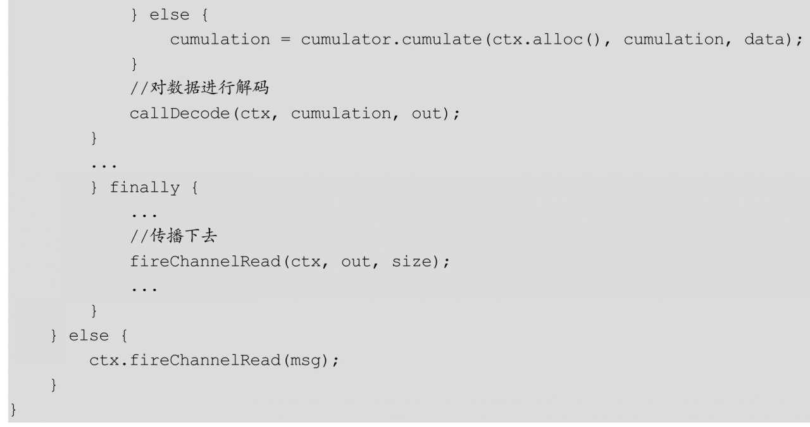

#Dubbo协议与网络传输
##Dubbo协议
在TCP协议栈中，每层协议都有自己的协议报文格式，比如TCP是网络七层模型中的传输层，是TCP协议报文格式；在TCP上层是应用层（应用层协议常见的有HTTP协议等），Dubbo协议作为建立在TCP之上的一种应用层协议，自然也有自己的协议报文格式。Dubbo协议也是参考了TCP协议栈中的协议，协议内容由header和body两部分组成，其结构如图13.1所示。

其中，协议头header格式如图13.2所示：

由图13.2可知，header总包含了16字节的数据。其中，前两字节为魔数，类似Class类文件里的魔数，这里用来标识一个帧的开始，固定为0xdabb，第一字节固定为0xda，第二字节固定为0xbb。
紧跟其后的一字节是请求类型和序列化标记ID的组合结果：requst flag|serializationId。其中，高四位标示请求类型，其枚举值如下：

低四位标示序列化方式，其枚举值如下：

再后面的一字节是只在响应报文里才设置（在请求报文里不设置），用来标示响应的结果码，具体定义如下：

其后的8字节是请求ID。

最后的4字节是body内容的大小，也就是指定在协议头header内容后的多少字节是协议body的内容。

##服务消费方编码原理
在3.3节我们讲到，在消费端启动时，NettyCodecAdapter管理的编解码器被设置到Netty链接的Channel管线里。下面我们看看服务消费端如何对Dubbo协议内容进行编码。

另外，在3.4节我们讲到，消费端发起一次调用后，最终会通过DubboInvoker的doInvoke（）方法内的远程调用客户端对象currentClient的request（）方法把请求发送出去。当网络传输使用Netty时，实际上是把请求转换为任务并投递到了NettyClient对应的Channel管理的异步队列里，这样当前的业务线程就会返回了，Netty会使用I/O线程去异步地执行该任务，把请求通过TCP链接发送出去。Netty异步处理的写入时序图如图13.3所示：

**在Netty中，每个Channel（NioSocketChannel）与NioEventLoopGroup中的某一个NioEventLoop固定关联，业务线程就是异步地把请求转换为任务，并写入与当前Channel关联的NioEventLoop内部管理的异步队列中，然后NioEventLoop关联的线程就会去异步执行任务，图13.3就是使用NioEventLoop关联的线程异步地把请求发送出去。**

在图13.3中，NioEventLoop关联的线程会把请求任务进行传递，即传递给该Channel管理的管线中的每个Handler，其中的一个Handler就是编解码处理器，也就是图13.3中的InternalEncoder，它又把任务委托给DubboCodec对请求任务进行编码，编码完毕执行步骤11，让编码后的数据沿管线继续流转下去。这里我们主要看看DubboCodec是如何按照Dubbo协议对请求进行编码的。

先看看DubboCodec的子类ExchangeCodec的encode（）方法，其代码如下：

首先我们看encodeRequest如何对请求信息进行编码：

代码1.1获取序列化扩展实现，默认为hession序列化方式。

代码1.2创建Dubbo协议扩展头字节数组，由于Dubbo协议的协议头部分为16字节，所以这里创建了16字节的byte数组。

代码1.3把魔数0xdabb写入协议头的前两字节。

代码1.4则把请求类型与序列化类型标记到协议头第3字节。

代码1.5把请求ID写入协议头的第5～12字节，由于是request类型，所以第4字节的响应码是不需要设置的。

代码1.6使用代码1.1获取的序列化方式对象数据部分进行编码，并把协议数据部分写入缓存（buffer）。

代码1.7刷新缓存。在代码1.8中，checkPayload检查协议数据部分是否超过了设置的大小，如果是则抛出异常：

如果检查合法，则把协议数据部分的大小写入协议头的第12～16字节。

代码1.9则首先把缓存的写入下标移动到写入协议数据前的位置，然后把协议头写入缓存，这时缓存里存放了完整的Dubbo协议帧（协议头+协议数据体），最后把缓存的写入下标设置为写入Dubbo协议帧后面的位置。

其实，encodeResponse对响应信息进行编码与encodeRequest代码类似，不同之处在于，前者需要对协议头的第4字节写入响应类型：

##服务发布方解码原理

大家都知道，在客户端与服务端进行网络通信时，客户端会通过socket把需要发送的内容序列化为二进制流后发送出去，接着二进制流通过网络流向服务器端，服务端接收到该请求后会解析该请求包，然后反序列化后对请求进行处理。这看似是一个很简单的过程，但细细想来却会发现没有那么简单。图13.4显示的是客户端与服务端交互的流程:

由图13.4可知，在客户端发送数据时，实际是把数据写入TCP发送缓存里，如果发送的包的大小比TCP发送缓存的容量大，那么这个数据包就会被分成多个包，通过socket多次发送到服务端。而服务端获取数据是从接收缓存里获取的，假设服务端第一次从接收缓存里获取的数据是整个包的一部分，这时就产生了半包现象。半包不是说只收到了全包的一半，是说收到了全包的一部分。

*  服务器读取到半包数据后，会对读取的二进制流进行解析，一般情况下会把二进制流反序列化为对象，但由于服务器只读取了客户端序列化对象后的一部分，所以反序列化会报错。

*  同理，如果发送的数据包大小比TCP发送缓存的容量小，并且假设TCP缓存可以存放多个包，那么客户端和服务端的一次通信就可能传递了多个包，这时服务端就可能从接收缓存一下读取了多个包，这样就出现了粘包现象。由于服务端从接收缓存获取的二进制流是多个对象转换来的，所以在后续的反序列化时肯定也会出错。

*  其实，出现粘包和半包的原因是TCP层不知道上层业务的包的概念，它只是简单地传递流，所以需要上层的应用层协议来识别读取的数据是不是一个完整的包

在3.1节我们提到，NettyServer启动时把NettyCodecAdapter内部管理的编解码器注入链接Channel的管线内。下面我们看看服务提供端是如何对Dubbo协议的内容进行解码的。

另外，在3.2节我们是直接从NettyServer的received（）方法开始讲起的，下面我们看看源头，也就是如何从Netty的NioEventLoop里从TCP缓存读取请求数据，然后经过解码操作后调用NettyServer的received（）方法的。首先我们看看如图13.5所示的时序图：

如前所述，

*  在Netty中，每个Channel（NioSocketChannel）与NioEventLoopGroup中的某一个NioEventLoop固定关联，NettyServer会为每个接收的链接创建一个Channel对象，这个Channel对象也会与Worker NioEventLoopGroup中的某一个NioEventLoop固定关联。另外，每个NioEventLoop会管理一个Selector对象和一个线程，线程会不断检查注册到该Selector对象上的Channel是否有读取事件，如果有，则从TCP缓存读取数据。

由图13.5可知，当有读取事件时，NioEventLoop关联的线程会从缓存读取数据，然后把数据传递给该Channel管理的管线中的handler，这里会把数据传递给NettyCodecAdapter的内部类InternalDecoder，下面我们看看它的channelRead（）方法：

在上面的代码中，解码操作是在callDecode（）方法中完成的。callDecode（）方法的代码如下:

其中，decodeRemovalReentryProtection内部调用decode（）方法，后者的代码如下：

代码0.1先将message缓存的当前的读取下标保存到变量saveReaderIndex中，然后代码0.1执行具体的解码操作。如果代码0.1返回了NEED_MORE_INPUT，则说明遇到了半包，此时将message的读取下标重置为保存的saveReaderIndex，然后退出循环。否则，执行代码0.3，说明解析出来了一个完整的Dubbo协议帧，并保存到out列表，然后如果message还可读（有数据可以读取），则再次循环执行代码0.1，直到没有数据可读取，就退出循环。

这里，我们具体看看codec.decode（DubboCodec的decode（）方法）的代码：

上面的代码先试图从缓存中读取Dubbo协议帧的协议头部分，然后调用decode（）方法解析协议的数据部分。其中decode（）方法的代码如下:

代码1.1首先检查魔数以便确定当前数据是Dubbo协议的数据。

代码1.2判断是否读取到了一个完整的Dubbo协议帧头，如果不是，则返回NEED_MORE_INPUT。

代码1.3解析出Dubbo协议帧数据部分（body）的大小，检查body的大小是否超过了设置的数据包大小，如果超过了，则抛出ExceedPayloadLimitException异常。

代码1.4判断是否遇到了半包问题，如果是，则直接返回NEED_MORE_INPUT。

代码1.5解析协议帧数据部分。

在上面的代码中，如果返回了NEED_MORE_INPUT，则说明遇到了半包的情况（数据不足以支撑一个完整的Dubbo协议帧），此时通过循环继续累加数据直到有至少一个完整协议帧。下面我们看看decodeBody（）方法是如何解析Dubbo协议帧数据部分的:

上面的代码比较简单，其流程与编码时的流程是相反的。值得注意的是，decode（）方法在过程中使用“`自定义协议header+body`”的方式来解决粘包、半包问题，其中header记录了body的大小，这种方式便于协议的升级。另外需要注意的是，在读取header后，message的读取指针已经后移了，如果后面发现出现了半包现象，则需要把读取指针重置。

本章首先探讨了Dubbo框架的协议帧格式，并讲解了服务消费端如何把发送的请求数据封装为Dubbo协议帧，并进行序列化处理，然后讲解了服务提供方如何解决半包粘包问题，以及如何把解码后的数据转换为POJO类对象。