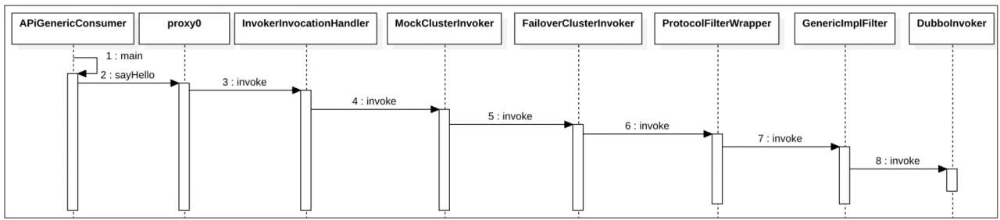
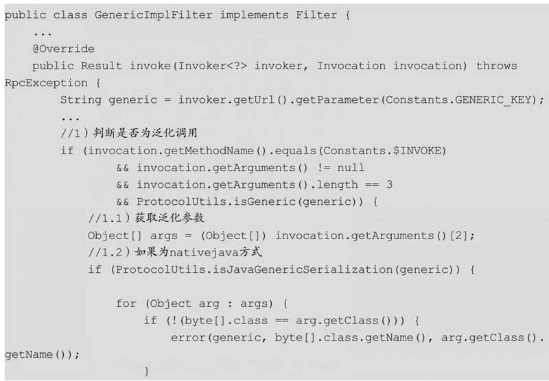
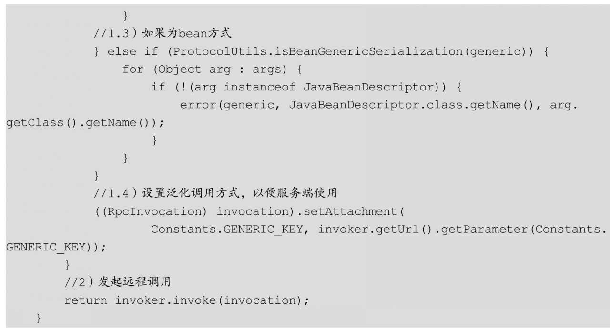
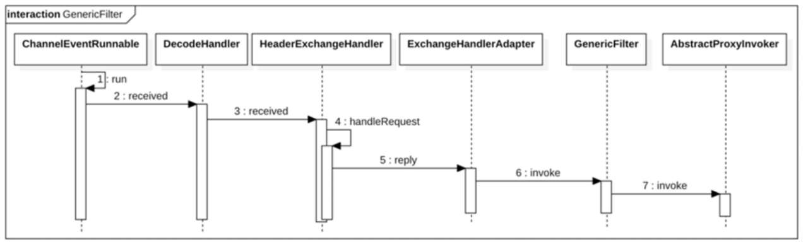
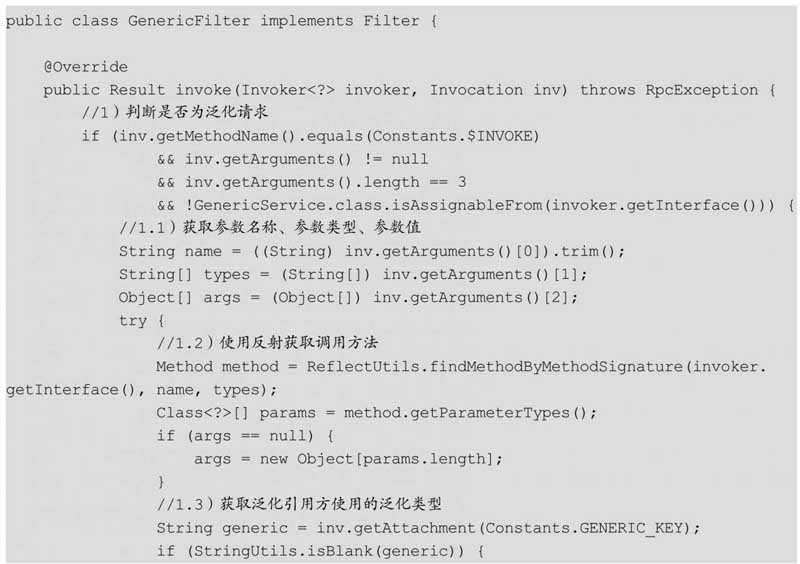
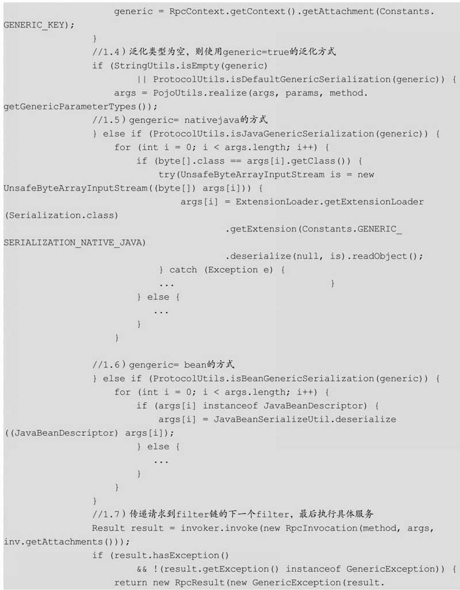
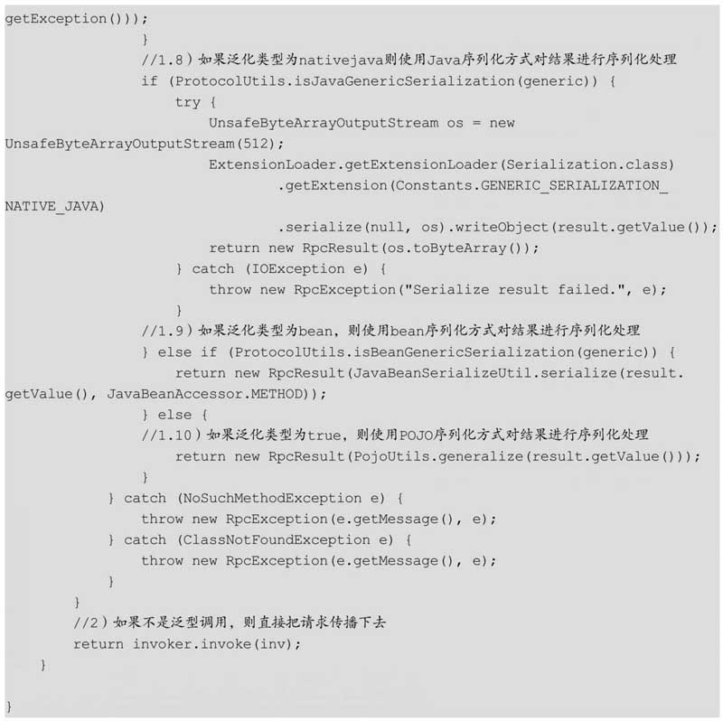

#Dubbo如何实现泛化引用
在基础篇中我们已经介绍了，基于Dubbo API搭建Dubbo服务时，服务消费端引入了一个SDK二方包，里面存放着服务提供端提供的所有接口类。

泛化接口调用方式主要是在服务消费端没有API接口类及模型类元（比如入参和出参的POJO类）的情况下使用，其参数及返回值中没有对应的POJO类，所以全部POJO均转换为Map表示。使用泛化调用时服务消费模块不再需要引入SDK二方包。

我们在本章中将探讨Dubbo如何实现泛化调用，主要内容包括：

**`服务消费端如何使用GenericImplFilter拦截泛化调用，把泛化参数进行校验并发起远程调用；服务提供方如何使用GenericFilter拦截请求，并把泛化参数进行反序列化处理，然后把请求转发给具体的服务进行执行`**。调用流程图如图所示。

##服务消费端GenericImplFilter源码分析
在基础篇中介绍的泛化调用有三个测试类，分别为APiGenericConsumerForTrue、APiGenericConsumerForNativeJava和APiGenericConsumerForBean，三者分别对应三种泛化引用。这里我们使用APiGenericConsumer来替代这三个类进行讲解，首先看看如图8.2所示的时序图:

通过图8.2可知，在消费端使用泛化调用发起请求后，请求会经过包装类ProtocolFilterWrapper创建的责任链。这里只展示了责任链中的GenericImplFilter过滤器，GenericImplFilter处理完后会把请求传递给被包装的DubboInvoker，然后DubboInvoker会发起远程调用，这里我们主要看看GenericImplFilter是如何实现泛化引用的：

代码1判断是否为泛化调用，如果不是，则直接指向代码2发起远程调用。

如果为泛化调用，则代码1.1获取泛化参数。代码1.2判断泛化调用是否为nativejava方式，如果是，则判断参数是否是byte[]类型的；如果不是，则说明参数传递错误，抛出异常（可以参考在基础篇的实例中讲过的APiGenericConsumerForNativeJava类）。在代码1.3中，如果泛化类型为bean方式，则判断参数是否为JavaBeanDescriptor类型；如果不是，则说明参数错误，抛出异常（可以参考在基础篇的实例中讲过的APiGenericConsumerForBean类）。

代码1.4把泛化类型设置到invocation的附加属性中，泛化类型需要被传递给服务端，以便服务端根据具体泛化类型对参数进行反序列化处理。

##服务提供端GenericFilter源码分析
在3.2节我们讲到，服务提供端默认会把接收到的请求封装为ChannelEventRunnable任务，并投递到业务线程池以便及时释放I/O线程，这里我们就从ChannelEventRunnable的执行开始，看看流程是如何走到GenericFilter的。服务提供端处理请求的时序图如图8.3所示：

从图8.3可以看到，当异步任务被执行时，请求会经过包装类ProtocolFilterWrapper创建的责任链。这里只展示了责任链中的GenericFilter过滤器，GenericFilter处理完后会把请求传递给AbstractProxyInvoker，然后AbstractProxyInvoker会进行本地服务的执行。这里我们主要看看GenericFilter是如何实现泛化引用的：

在代码1中，判断当前请求是不是泛化调用，如果不是泛化调用，则直接执行代码2把请求传播下去；如果是泛化调用，则执行代码1.1以获取调用方法的参数信息，然后使用代码1.2来获取调用方法的实例。

代码1.3用来获取泛化引用方使用的泛化类型，如果泛化类型为空，则代码1.4默认以generic=true的泛化方式对参数进行反序列化处理；如果序列化方式为nativejava，则代码1.5使用Java的反序列化对参数进行反序列化处理；如果泛化类型为bean，则代码1.6使用JavaBeanSerializeUtil对参数进行反序列化处理。

代码1.7将请求传递到Filter链的下一个Filter，最后执行具体服务。

代码1.8和代码1.9则是根据泛化类型对服务执行结果进行序列化处理，所以服务引用方在收到结果后还需要对结果进行反序列化处理。