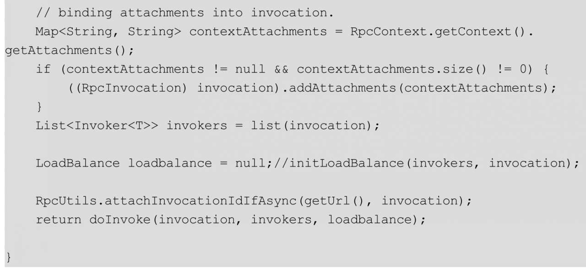

#Dubbo实践

##Arthas的简介与安装

1. wget https://alibaba.github.io/arthas/arthas-boot.jar
2. java  -jar  arthas-boot.jar

##查看扩展接口适配器类的源码
在第2章，我们讲解了Dubbo的适配器原理，了解到每个扩展接口对应一个适配器类，并且这个适配器类是使用动态编译技术生成的，一般情况下只有使用Debug才能看到适配器的源码，但是使用Arthas我们就可以在服务启动的情况下查看某个适配器源码。

比如我们想查看扩展接口org.apache.dubbo.rpc.Protocol的适配器类源码，在启动Dubbo服务和Arthas后，在Arthas的控制台执行下面的命令即可：

`jad org.apache.dubbo.rpc.Protocol$Adaptive`

同理，其他扩展接口的适配器类源码也可以使用类似的方法得到。

##查看服务提供端Wrapper类的源码
在2.5.4小节我们讲到，Dubbo会给每个服务提供者的实现生成一个Wrapper类，在这个Wrapper类里最终是调用服务提供者的接口实现类，Wrapper类的存在是为了减少反射的调用。那么我们可以使用jad命令方便地查看被包装后的某一个服务实现类，以便探究它是如何工作的。

为此，在启动Dubbo服务提供端和Arthas后，在Arthas的控制台执行下面的命令即可：

`jad org.apache.dubbo.common.bytecode.Wrapper1`

这样就查看到了GreetingServiceImpl服务类被包装后的代码。

##查询Dubbo启动后都有哪些Filter
在Dubbo中，Filter链是一个亮点，通过Filter链可以对服务请求和服务处理流程进行干预，有时候我们想要知道运行时到底有哪些Filter在工作，这时使用Arthas的trace命令显得比较重要。

可以在启动Dubbo服务提供端和Arthas后，在Arthas的控制台执行如下命令:

`trace  org.apache.dubbo.rpc.Filter *`

由此可知，当前运行的服务提供端的Filter链中的Filter包括:

同理，大家可以在服务消费端启动后看其运行的Filter链中都有哪些Filter。

##如何动态获取Dubbo服务提供方地址列表

###场景概述

Dubbo框架本身提供了丰富的负载均衡策略，比如轮询、随机、最少活跃调用数、一致性Hash等，但是有时候我们需要自己根据业务指定某个IP来进行调用。

那么什么时候需要指定IP来调用呢？我们考虑一个并行任务处理系统，系统接受一个大任务后会切割为若干子任务，然后把子任务分派到不同的机器上去执行，这时就需要把子任务路由到指定的IP上去运行，如图所示。

从图可以看到，任务切割与调度系统首先把SDK传递的任务分为子任务1到子任务6，然后把任务1和任务2分配到任务处理系统的机器1来执行，把任务3和任务4分配到任务处理系统的机器2来执行，把任务5和任务6分配到任务处理系统的机器3来执行。

要指定IP进行调用，需先知道服务提供者的IP。本节我们先来探讨第一步，看看当服务注册中心使用ZooKeeper时如何获取某一个服务提供端的地址列表。

###原理与实现
我们知道，当服务提供方启动时，Dubbo会将服务注册到服务注册中心，这里我们使用的服务注册中心是ZooKeeper，比如服务com.books.dubbo.demo.api.GreetingService注册到ZooKeeper后，其结构是如图14.3所示的树形结构：

当消费端启动时，Dubbo会去ZooKeeper上订阅/dubbo/com.books.dubbo.demo.api.GreetingService/providers节点下面的信息，也就是服务提供者列表信息。所以，我们可以基于这个原理来获取服务提供者列表，然后对信息进行过滤加工从而获取服务提供者地址列表，并且注册ZooKeeper的一个监听器，当服务提供者机器增减后，动态更新保存的地址列表。

基于上面原理的实现代码如下：

在上面的代码中，main（）函数创建了一个ZooKeeperIpList对象，并且调用其init（）方法，参数分别为ZooKeeper地址、ZooKeeper分组、服务接口以及版本、服务分组。

在ZookeeperIpList的init（）方法内，首先执行代码1进行参数校验，然后执行代码2拼接要订阅的ZookeeperIpList的path，拼接完成后dataid为/dubbo/com.books.dubbo.demo.api.GreetingService/providers，然后代码3创建zkClient订阅该dataid对应的path，并且注册监听器，当path下的信息变化后会得到最新的列表。另外，这里使用parseIpList（）方法解析获取的地址列表，解析完毕后保存到ipList中。

本节介绍的这个简单的演示，是基于ZooKeeper获取服务提供者地址列表的方法。该方法并不一定适合生产环境，大家如果想在生产环境中使用，需要进行量身改造，以免出现故障。

##根据IP动态路由调用Dubbo服务

前面我们探讨了如何获取某一个Dubbo服务的提供者列表，本节我们探讨如何使用Dubbo的扩展，实现指定IP调用。

在Dubbo中，集群容错策略Cluster是SPI扩展接口，Dubbo框架提供了丰富的集群容错策略实现。集群容错策略会先从RegistryDirectory获取所有服务提供者的invoker列表，然后使用负载均衡策略从中选择一个inovker来发起远程调用。基于此原理，我们可以实现自己的集群容错策略，一开始还是使用RegistryDirectory获取所有服务提供者的invoker列表，但是不执行负载均衡策略，而是使用我们在发起远程调用前与指定的IP相匹配的invoker来进行发远程调用。至于如何在每次调用前指定IP，可以使用RpcContext.getContext（）.set（"ip"，"30.10.67.231"）来完成。

基于上述思路，本节我们就基于扩展接口实现指定IP调用的功能，首先我们实现扩展接口Cluster：

然后，我们看看自己实现的MyClusterInvoker：

在上面的代码1中，我们从RpcContext.getContext（）方法中获取了属性值IP，如果该值不为空，则说明指定了IP。

代码2检查是否有可用的服务提供者，如果没有则抛出异常。

代码3遍历invokers列表查找指定IP对应的invoker，如果没有指定IP对应的invoker，则抛出异常。

代码4使用选择的invoker发起远程调用。

注意，我们还将框架的AbstractClusterInvoker修改为MyAbstractClusterInvoker：

这里我们把LoadBalance loadbalance=initLoadBalance（invokers，invocation）；修改为LoadBalance loadbalance=null；，因为我们不需要负载均衡了。

扩展实现写好后，要把扩展实现配置到如图14.4所示的文件中。

然后，在消费端调用时进行如下设置就可以指定IP调用了。让我们看看Demo的Consumer模块的APiConsumerSetIpcall类：

上面的代码4创建ZookeeperIpList对象并初始化，代码5则调用ZookeeperIpList的getIpList（）方法获取所有服务提供者地址列表，然后轮询指定IP进行调用，也就是我们实现了动态IP指定路由调用，每次发起远程调用前，可以指定那一台服务提供方来提供服务。

本节只是简单演示了如何指定IP动态路由，并不一定适合生产环境，大家如果想在生产环境中使用，需要进行量身改造，以免出现故障。

这里我们回顾一下，Dubbo本身提供了服务直连功能，也就是在创建引用对象时可以指定一个IP进行调用以便点对点进行测试，需要注意的是，这个服务直连只能在服务启动前指定一次，不能在每次发起远程调用前动态改变。

另外，Dubbo本身提供了广播的集群容错策略，从而可以给所有的提供者并发发送请求，但是该策略在广播时给每个提供者传递的参数是一样的，不能够同时给不同服务提供者传递不同的参数；此外，其返回结果不是所有提供者返回结果的聚合结果，而是其中一个提供者的结果。基于上面两点，本节才基于业务需要指定IP动态路由调用服务。

##基于CompletableFuture和Netty模拟RPC同步与纯异步调用

Dubbo的服务消费端基于CompletableFuture实现了纯异步调用，其实还不单单是CompletableFuture的功劳，归根到底是Netty的NIO非阻塞功能提供的底层实现，本节我们就基于CompletableFuture和Netty来模拟一下如何异步发起远程调用，以便加深对Dubbo异步调用实现原理的理解。

###协议帧定义

为简化设计，这里我们定义应用层协议帧格式为文本格式，如图14.5所示：

在图14.5中，帧格式的第一部分为消息体，也就是业务需要传递的内容，第二部分为“：”，第三部分为请求ID，这里使用“：”把消息体与请求ID分开，以便服务端可以方便地提取出来这两部分内容，需要注意，消息体内不能含有“：”；第四部分“|”标识一个协议帧的结束，因为本Demo使用Netty的DelimiterBasedFrameDecoder来解决半包粘包问题。对比Dubbo的协议帧，本节的协议帧的定义就是一个演示。

###RpcServer的实现

首先我们基于Netty开发一个简单的Demo用来模拟RpcServer，也就是服务提供方程序。RpcServer的代码如下：

如上代码是一个典型的NettyServer启动程序，首先代码0创建了NettyServer的boss与worker线程池，然后代码1创建了业务NettyServerHandler（后面会具体讲解）；代码1.1将DelimiterBasedFrameDecoder解码器添加到链接Channel的管道，以便使用“|”分隔符来确定一个协议帧的边界（避免半包粘包问题）；代码1.2添加字符串解码器，这样的话在服务端链接Channel接收到客户端发来的消息后，自动把消息内容转换为字符串；代码1.3设置字符串编码器，用于在服务端链接Channel向客户端写入数据时，对数据进行编码；代码1.4将业务handler添加到管线。

代码2启动服务，并且在端口12800监听客户端发来的链接；代码3同步等待服务监听套接字关闭；代码4关闭两级线程池，以便释放线程。

这里我们主要看看业务Handler的实现，服务端在接收客户端消息并且消息内容经过代码1.1和代码1.2的Hanlder处理后，流转到NettyServerHandler的就是一个完整的协议帧的字符串了。NettyServerHandler的代码如下：

在上面的代码中，@Sharable注解是让服务端所有接收的链接对应的Channel复用同一个NettyServerHandler的实例。这里可以使用@Sharable方式，因为NettyServerHandler内的处理是无状态的，不会存在线程安全问题。

当数据流转到NettyServerHandler时，会调用其channelRead（）方法进行处理，这里的msg已经是一个完整的协议帧了。代码6为了及时释放Netty的I/O线程，把任务投递到AllChannelHandler管理的线程池内执行（这里仿照了Dubbo的All线程模型）。

在异步任务内，代码6.1接收消息体的内容，然后根据协议格式，从中截取出请求ID，然后调用代码6.2拼接返回给客户端的协议帧。需要注意的是，这里需要把请求ID带回去，然后休眠2s模拟服务端任务处理，最后代码6.3把拼接好的协议帧写回客户端。

其中，AllChannelHandler的代码如下：

###RpcClient的实现

首先我们基于Netty开发一个简单的Demo用来模拟RpcClient，也就是服务消费方程序。RpcClient的代码如下：

在上面的代码中，RpcClient的构造函数创建了一个NettyClient，它与NettyServer类似。需要注意的是，这里将业务的NettyClientHandler处理器注册到链接Channel的管线里，并且在与服务端完成TCP三次握手后把对应的Channel对象保存了下来。

· rpcSyncCall（）方法：该方法意在模拟同步远程调用，其中代码1创建了一个CompletableFuture对象；代码2使用原子变量生成一个请求ID；代码3把业务传递的msg消息体和请求ID组成协议帧；代码4调用sendMsg（）方法通过保存的Channel对象把协议帧异步发送出去，该方法是非阻塞的，会马上返回，所以不会阻塞业务线程；代码5把代码1创建的future对象保存到FutureMapUtil管理的并发缓存中，其中key为请求ID，value为创建的future。FutureMapUtil就是管理并发缓存的一个工具类，其代码如下：

然后，代码6调用future的get（）方法，同步等待future的complete（）方法设置完结果，调用get（）方法会阻塞业务线程，直到future的结果被设置。

· rpcAsyncCall（）方法：我们看看rpcAsyncCall（）方法的异步调用，其代码实现与同步的rpcSyncCall（）方法类似，只不过其没有同步等待future的结果值，而是直接将future返回给调用方，然后就直接返回了，该方法不会阻塞业务线程。

至此，我们讲解了业务调用时远程调用的发起，下面我们看看服务端将结果写回客户端后，客户端如何把接入写回对应的future。为此我们需要看以一下注册的NettyClientHandler，其代码如下：

在上面的代码中，当NettyClientHandler的channelRead（）方法被调用时，其中msg已经是一个完整的协议帧了（因为DelimiterBasedFrameDecoder与StringDecoder已经做过解析），这里的channelRead（）方法把对msg消息的处理提交到AllChannelHandler管理的线程池，以便及时释放Netty的I/O线程。

在异步任务内，代码1首先根据协议帧格式，从消息msg内获取到请求ID，然后从FutureMapUtil管理的缓存内获取请求ID对应的future对象并移除；如果请求ID存在，代码2则从协议帧内获取服务端写回的数据，并调用future的complete（）方法把结果设置到future，这时由于调用future的get（）方法而被阻塞的线程就返回结果了。

###实例
前面我们讲解了RpcClient与RpcServer的实现，下面我们通过两个例子看看具体如何完成。首先我们看看TestModelAsyncRpc类的代码：

在上面的代码中，在main（）函数内首先创建了一个rpcClient对象，然后代码1同步调用了其rpcSyncCall（）方法，由于是同步调用，因此在服务端执行返回结果前，当前的调用线程会被阻塞，直到服务端把结果写回客户端，客户端把结果写回对应的future对象后才会返回。

代码2调用了异步方法rpcAsyncCall（），其不会阻塞业务调用线程，而是马上返回一个CompletableFuture对象，然后我们在其上设置了一个回调函数，意在等future对象的结果被设置后进行回调，这就实现了真正意义上的异步。

我们再通过一个实例，演示一下如何基于CompletableFuture的能力，并发发起多次调用，然后对返回的多个CompletableFuture进行运算，为此我们看看TestModelAsyncRpc2类的代码：

代码1首先发起一次远程调用，该调用马上返回future1；然后代码2又发起一次远程调用，该调用也马上返回future2对象；代码3则基于CompletableFuture的能力，意在让future1和fuuture2都有结果后再基于两者的结果做一件事情（这里是拼接两者返回的结果），并返回一个获取回调结果的新future。

代码4基于新的future，在其结果产生后，执行新的回调函数，进行结果打印或者异常打印。

至此，我们基于CompletableFuture和Netty模拟RPC同步与纯异步调用的内容已经讲完了，相信大家通过这个模拟对Dubbo的异步调用实现会有一定的理解。