#Dubbo并发控制
由于资源的限制，一般会在服务提供方和消费方限制接口调用的并发数，本章将探讨相关的原理。图9.1是原理的模型图：
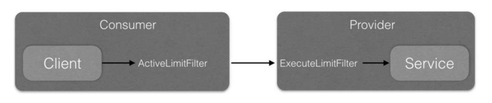

服务消费端并发控制
在基础篇的Demo中，APiConsumerForActiveLimit类使用了消费端并发控制，其代码如下：
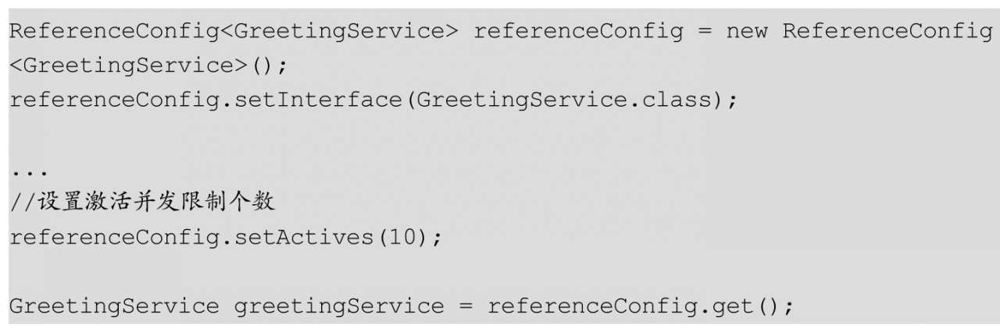
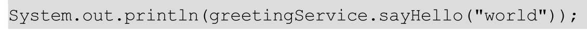

上面的代码对com.books.dubbo.demo.api.GreetingService接口中的所有方法进行了设置，每个方法最多同时并发请求10个。其实也可以只设置接口GreetingService中某一个方法的并发请求限制个数：
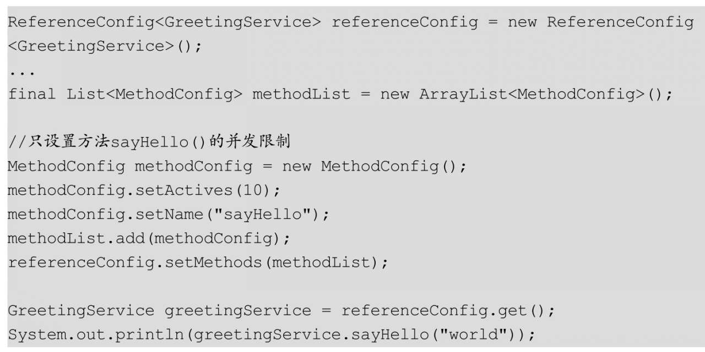

在服务消费端，具体进行并发控制的是ProtocolFilterWrapper类创建的Filter链中的ActiveLimitFilter（）方法，下面我们看看如图9.2所示的调用时序图：
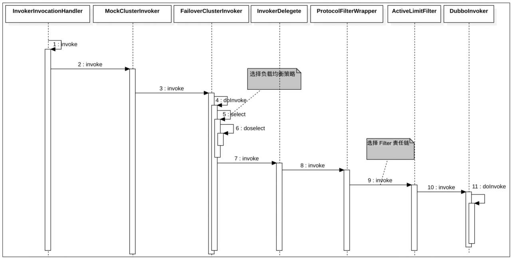

在上面的代码中，在DubboInvoker的invoke（）方法真正向远端发起RPC请求前，请求会先经过ActiveLimitFilter的invoke（）方法，其代码如下：
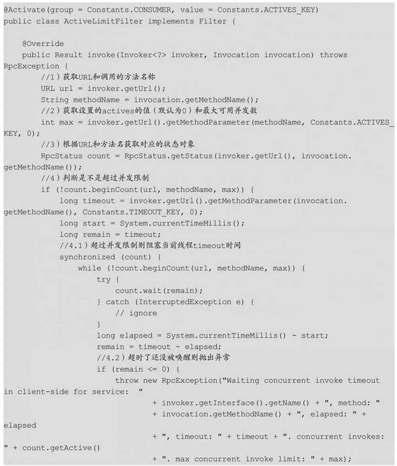
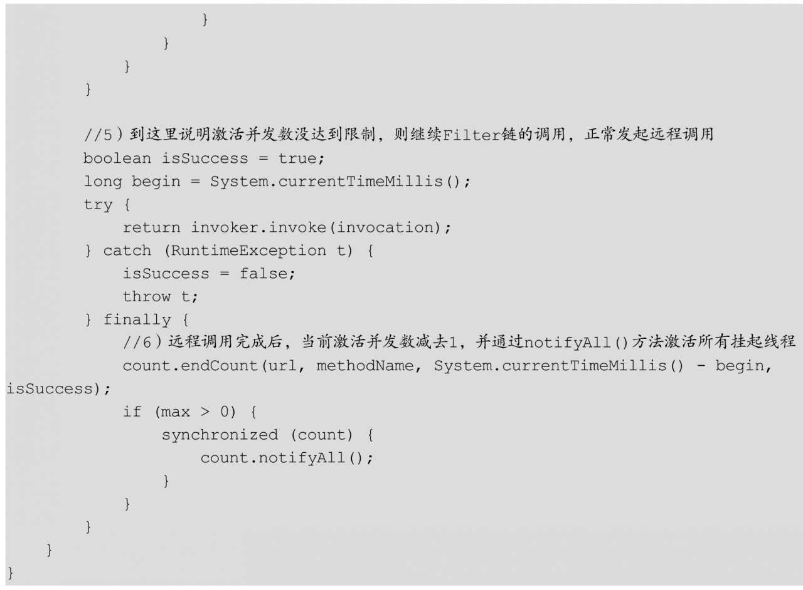

代码2获取设置的最大活跃并发数，代码2根据URL和调用方法名获取对应方法的RPC状态对象，这里我们来看看RpcStatus是如何统计远程调用状态的：
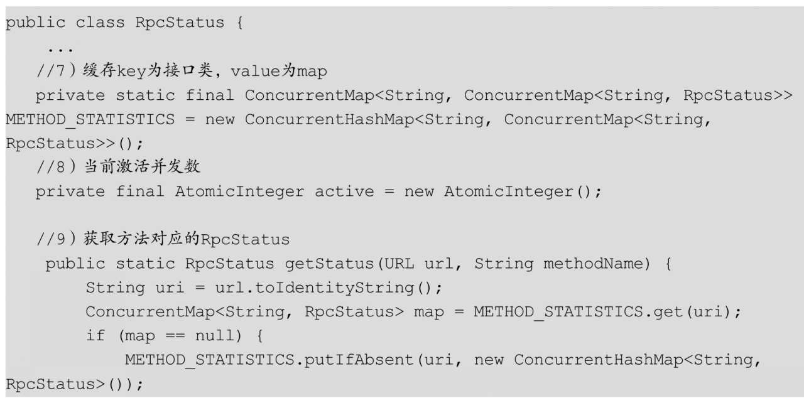
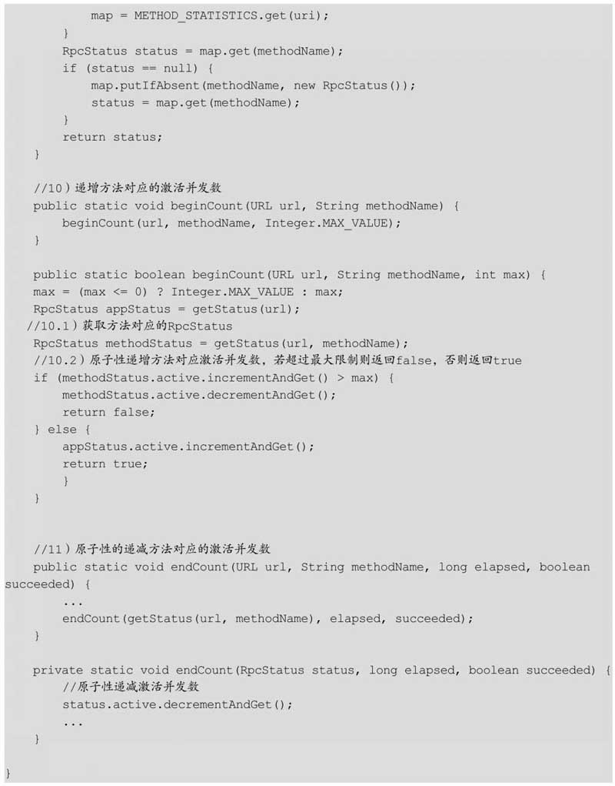

通过上面的代码可知，在RpcStatus中维护了一个并发安全的METHOD_STATISTICS缓存，其中key为服务接口，value为该服务接口中所有方法的一个缓存，后者ConcurrentMap＜String，RpcStatus＞的key为具体的方法，value为RpcStatus对象。

代码9根据URL和方法名称获取方法对应的RpcStatus对象，如果不存在则创建一个新的。

代码10则调用beginCount（）方法，参数为URL和方法名，代码10.1首先根据URL和方法名获取对应的RpcStatus对象，接着代码10.2递增该方法状态对象中的原子性变量（增加该方法的并发激活数量），然后判断当前激活并发数量是不是超过了最大并发数，如果是则返回false，否则返回true。

如果beginCount（）方法返回了false，则让当前线程挂起timeout时间，然后当前线程会在timeout时间后再被唤醒，或者当其他线程调用了count的notifyAll（）方法时被唤醒。如果超过timeout时间还没被唤醒，则当前线程会自动被唤醒，然后抛出RpcException异常，也就是说远程调用还没到达服务提供方，调用方就抛出异常结束了。

如果beginCount（）方法返回了true，则说明当前方法的激活并发数没有达到最大值，此时将执行代码5，继续Filter链的调用，最终向远端发起调用，调用完毕后执行代码6的endCount（）方法以递减当前方法的激活并发数（endCount（）方法的代码见代码11，这里首先根据URL和方法名获取方法对应的RpcStatus变量，然后执行原子性递减）。代码6还调用了当前方法对应的count的notifyAll（）方法来激活代码4.1中被阻塞的线程。

综上所述，在客户端并发控制中，如果当激活并发量达到指定值后，当前客户端请求线程会被挂起。如果在等待超时期间激活并发请求量少了，那么阻塞的线程会被激活，然后发送请求到服务提供方；如果等待超时了，则直接抛出异常，这时服务根本就没有发送到服务提供方服务器。

##服务提供端并发控制
在基础篇的Demo中，ApiProviderForExecuteLimit使用了服务提供端并发控制：
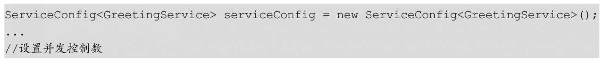
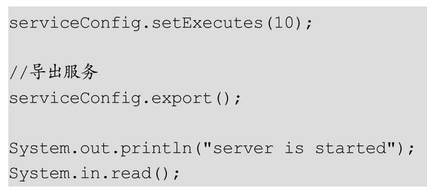

上面的代码对com.books.dubbo.demo.api.GreetingService接口中的所有方法进行了设置，每个方法最多同时处理10个请求。其实也可以只设置接口GreetingService中的某一个方法的并发处理限制个数：
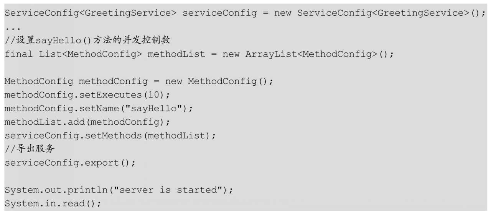

上面的代码只设置了sayHello（）方法的同时并发处理数目。

在服务提供端，具体进行并发控制的是ProtocolFilterWrapper类创建的Filter链中的ExecuteLimitFilter（）方法，下面我们看看如图9.3所示的调用时序图：
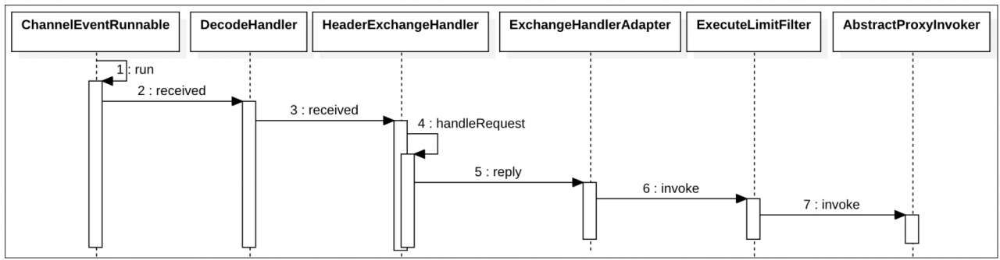

在上面的代码中，服务提供方的AbstractProxyInvoker的invoke（）方法在真正执行服务处理的前，请求会先经过ExecuteLimitFilter的invoke（）方法，其代码如下：
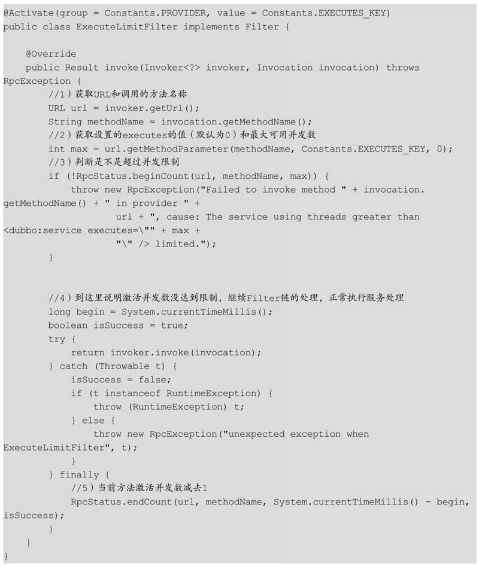

代码2获取设置的executes的值，代码3递增方法对应的激活并发数。如果并发数超过了设置最大值，则直接抛出异常，否则执行代码4继续Filter链的处理，正常执行服务处理，然后执行代码5将当前方法激活并发数减去1。

**需要注意的是，服务提供方设置并发数后，如果同时请求数超过了设置的executes的值，则会抛出异常，而不是像消费端设置actives时那样去等待。**