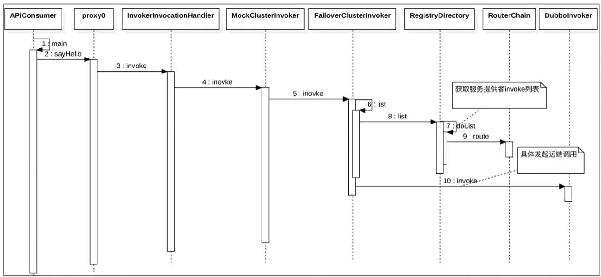

#Dubbo消费端服务mock与服务降级策略原理
##服务降级原理
###1. 降级策略注册
   我们介绍了使用下面的代码可以将服务降级信息注册到ZooKeeper：
   

当以参数force调用上述代码时，降级策略就会写入ZooKeeper服务器com.books.dubbo.demo.api.GreetingService子树中Type为configurators的下面，如图5.1所示。当然，也可以使用admin手动配置服务降级策略。

当服务消费者启动时，会去订阅com.books.dubbo.demo.api.GreetingService子树中的信息，比如Providers（服务提供者列表）、Routes（路由信息）、Configurators（服务降级策略）等信息。

当服务消费者发起远程调用时，会看是否设置了force：return降级策略，如果设置了则不发起远程调用并直接返回mock值，否则发起远程调用。当远程调用结果OK时，直接返回远程调用返回的结果；如果远程调用失败了，则看当前是否设置了fail：return的降级策略，如果设置了，则直接返回mock值，否则返回调用远程服务失败的具体原因。

###2. 服务消费端使用降级策略
   我们看一幅简化的时序图，了解一下从消费端发起远程调用的流程：
   

从图中可以看出，服务消费端是在**MockClusterInvoker**类的invoke（）方法里使用降级策略并在DubboInvoker的invoke（）方法里发起远程调用的，**所以服务降级是在消费端还没有发起远程调用时完成的**。

所以我们看看MockClusterInvoker类的代码：

通过上面的代码可知，其中directory.getUrl（）方法获取的就是上一节我们讲解overrideDirectoryUrl，代码1查看该URL里面是否含有mock的值,

如果没有或者有但是值为false，说明没有设置降级策略，则执行代码2.1，也就是正常发起远程调用。

如果URL里面含有mock字段，并且其值以force开头，则说明设置了force：return降级策略，那么直接调用doMockInvoke（）方法（其内部会调用创建的MockInvoker的invoke（）方法），返回mock值，而不发起远程调用。

如果URL里面含有mock字段，并且其值以fail开头，则说明设置了fail：return降级策略，那么先发起远程调用。如果远程调用成功，则直接返回远程返回的结果（如果这里使用了默认的集群容错策略，则代码4.1会调用FailoverClusterInvokerd的invoke（）方法发起远程调用）；如果发起远程调用失败，则执行代码4.3，直接返回mock的值。

##本地服务mock原理
###1. mock合法性检查
   我们讲解了在服务引用启动时会在ReferenceConfig的init（）方法内调用checkMock来检查设置的mock的正确性，下面我们看看相应的代码：
   
   

由于我们的Demo是将mock设置为true，所以我们会看到代码4将检查mock接口的实现类是否符合规则，MockInvoker.getMockObject的代码如下：

如果代码5中的mock类型为true或者deafult，则mockService被设置为接口名称加上Mock，例如，如果接口为com.books.dubbo.demo.api.GreetingServic并且mock设置为true，则这里的mockService就是com.books.dubbo.demo.api.GreetingServicMock，然后代码6加载com.books.dubbo.demo.api.GreetingServicMock的字节码文件以创建Class对象，代码7则创建实例。上面这些代码的作用是查看用户程序的classpath下是否存在mock类的实现com.books.dubbo.demo.api.GreetingServicMock，如果不存在，则抛出异常。

###2. 服务消费端使用mock服务
   mock服务与服务降级策略一样，也是在MockClusterInvoker中实现的，这里我们再看看其中的invoke（）方法：
   

由于我们设置的mock为true，所以这里的value为true，代码会执行到步骤3也就是fail-mock阶段，**`这也说明了服务mock与服务降级的fail-mock功能相似，不同之处在于前者会设置mock服务实现类，而后者是返回设置的静态返回值。`**
代码3会首先发起远程RPC，如果成功则不会执行mock操作，否则执行doMockInvoke

MockInvoker的invoke（）方法如下:

通过上面的代码可知，根据mock类型的不同，返回不同的mock值。这里我们重点看看代码7，即mock实现类GreetingServiceMock如何返回mock值：

通过上面的代码可知，如果缓存里含有mock实现类对应的invoker对象，则直接返回，否则使用getMockObject（）方法创建对象实例，并进行代理后保存到缓存，然后返回。在调用代理的invoke（）方法后，就会调用mock实现类GreetingServiceMock的方法。