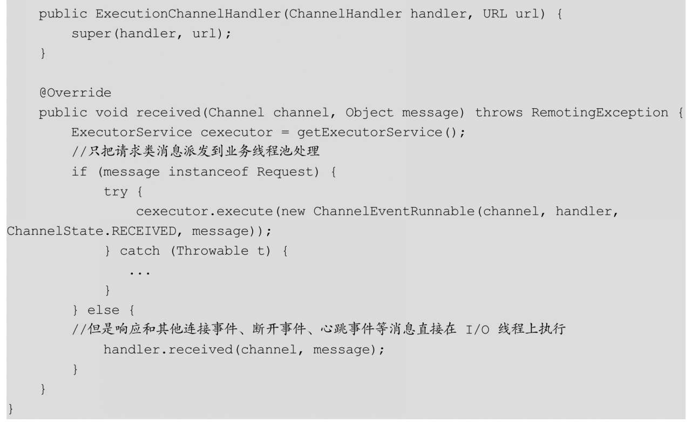
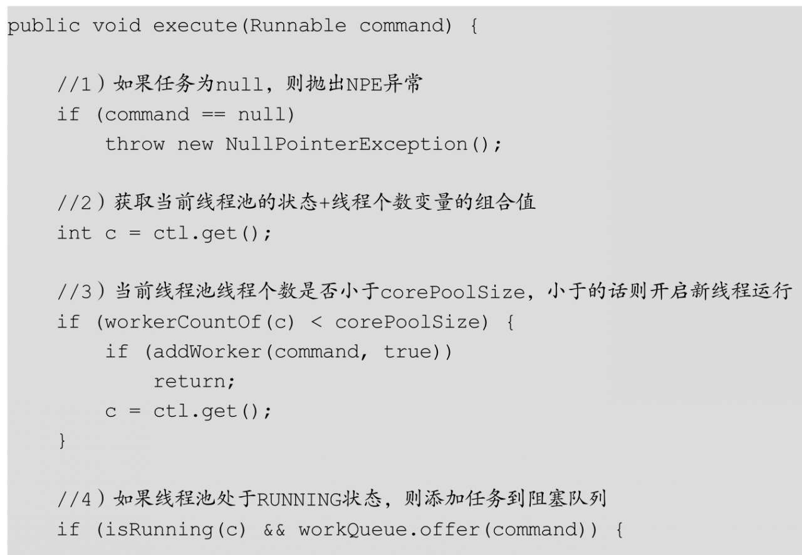

#Dubbo线程模型与线程池策略
##Dubbo的线程模型概述
Dubbo默认的底层网络通信使用的是Netty，服务提供方NettyServer使用两级线程池，其中EventLoopGroup（boss）主要用来接收客户端的链接请求，并把完成TCP三次握手的连接分发给EventLoopGroup（worker）来处理，我们把boss和worker线程组称为I/O线程。

如果服务提供方的逻辑处理能迅速完成，并且不会发起新的I/O请求，那么直接在I/O线程上处理会更快，因为这样减少了线程池调度与上下文切换的开销。

但如果处理逻辑较慢，或者需要发起新的I/O请求，比如需要查询数据库，则I/O线程必须派发请求到新的线程池进行处理，否则I/O线程会被阻塞，导致不能接收其他请求。

根据请求的消息类是被I/O线程处理还是被业务线程池处理，Dubbo提供了下面几种线程模型：

1. all（AllDispatcher类）：所有消息都派发到业务线程池，这些消息包括请求、响应、连接事件、断开事件、心跳事件等，如下图：
   

2. direct（DirectDispatcher类）：所有消息都不派发到业务线程池，全部在IO线程上直接执行，如图所示:
   
   
3. message（MessageOnlyDispatcher类）：只有请求响应消息派发到业务线程池，其他消息如连接事件、断开事件、心跳事件等，直接在I/O线程上执行，如图所示
   
   
4. execution（ExecutionDispatcher类）：只把请求类消息派发到业务线程池处理，但是响应、连接事件、断开事件、心跳事件等消息直接在I/O线程上执行，如图所示
   
   
5. connection（ConnectionOrderedDispatcher类）：在I/O线程上将连接事件、断开事件放入队列，有序地逐个执行，其他消息派发到业务线程池处理，如图所示
   
   
在Dubbo中，线程模型的扩展接口为Dispatcher，其提供的上述扩展实现都实现了该接口，其中all模型是默认的线程模型。

###AllDispatcher源码剖析
AllDispatcher对应的是all线程模型的实现，其代码如下：

通过上面的代码可知，这种线程模型把所有事件都直接交给业务线程池进行处理了。

###DirectDispatcher源码剖析
DirectDispatcher对应的是direct线程模型的实现，其代码如下：

通过上面的代码可知，direct线程模型的dispatch（）方法直接返回了参数handler，所以其所有事件的处理都是在I/O线程上进行的。

###MessageOnlyDispatcher源码剖析
MessageOnlyDispatcher对应是message线程模型的实现，其代码如下：

其中，核心实现MessageOnlyChannelHandler的代码如下：

通过上面的代码可知，只有请求响应消息派发到业务线程池，其他耗时比较短的连接事件、断开事件、心跳事件等消息则直接在I/O线程上执行。

###ExecutionDispatcher源码剖析
ExecutionDispatcher对应是execution线程模型的实现，其代码如下：

其中，核心实现ExecutionChannelHandler的代码如下：

通过上面的代码可知，只把请求类消息派发到业务线程池处理，但是响应、连接事件、断开事件、心跳事件等消息则直接在I/O线程上执行。这里与message模型不同之处在于，响应类型的事件也是在I/O线程上执行的。

###ConnectionOrderedDispatcher源码剖析
ConnectionOrderedDispatcher对应是connection线程模型的实现，其代码如下：

其中，核心实现ConnectionOrderedChannelHandler的代码如下：

在代码1中，在构造函数内创建一个只含有一个线程的线程池和一个有限元素的队列，如果设置的参数connect.queue.capacity大于0，则设置为线程池队列容量，否则线程池队列容量为整数最大值，这个线程池用来实现把链接建立和链接断开事件进行顺序化处理。

代码2、代码3分别处理链接建立、链接断开事件，可以先使用代码9检查线程池队列的元素个数，个数超过阈值则打印日志，然后把事件放入线程池队列，并使用单线程进行处理。由于是单线程处理，所以其实是“多生产-单消费”模型，实现了把链接建立、链接断开事件的处理变为顺序化处理。

代码4、代码5则处理请求事件和异常事件，这里是直接交给了线程池（这个线程池不是connectionExecutor）进行异步处理。

###线程模型的确定时机
前面介绍了Dubbo提供的线程模型，下面我们介绍的是何时确定使用哪种线程模型。在前面的3.1节提到，服务提供方会启动NettyServer来监听消费方的链接，其构造函数如下:

这里我们主要看看ChannelHandlers.wrap（handler，ExecutorUtil.setThreadName（url，SERVER_THREAD_POOL_NAME））这个代码，该代码加载了具体的线程模型，这是通过ChannelHandlers的wrapInternal方法完成的：

这里根据URL里的线程模型来选择具体的Dispatcher实现类。在此，我们再提一下Dubbo提供的Dispatcher实现类，其默认的实现类是all:

###如何基于扩展接口自定义线程模型
Dubbo提供了常用的线程模型，这些模型可以满足我们绝大部分的需求，但是也可以根据自己的需要进行扩展定制。

首先，我们需要实现扩展接口Dispatcher，其代码如下:

然后，我们需要实现自己的Handler，这里的实例为MyChannelHandler，我们需要在项目的src/main/resources目录下创建目录/META-INF/dubbo，并在该目录下创建文件org.apache.dubbo.remoting.Dispatcher，文件内容为mydispatcher=com.books.dubbo.demo.provider.mydispatcher.MyDispatcher.

最后，在服务提供者启动时将线程模型设置为mydispatcher即可：

##Dubbo的线程池策略
我们在上面讲解Dubbo线程模型时提到，为了尽量早地释放Netty的I/O线程，某些线程模型会把请求投递到线程池进行异步处理，那么这里所谓的线程池是什么样的线程池呢？其实这里的线程池ThreadPool也是一个扩展接口SPI，Dubbo提供了该扩展接口的一些实现，具体如下。

- FixedThreadPool：创建一个具有固定个数线程的线程池。
- LimitedThreadPool：创建一个线程池，这个线程池中的线程个数随着需要量动态增加，但是数量不超过配置的阈值。另外，空闲线程不会被回收，会一直存在。
- EagerThreadPool：创建一个线程池，在这个线程池中，当所有核心线程都处于忙碌状态时，将创建新的线程来执行新任务，而不是把任务放入线程池阻塞队列。
- CachedThreadPool：创建一个自适应线程池，当线程空闲1分钟时，线程会被回收；当有新请求到来时，会创建新线程。
  
###FixedThreadPool源码剖析

代码1获取用户设置的线程池中线程的名称前缀，如果没有设置，则使用默认名称Dubbo。

代码2获取用户设置的线程池中线程的个数，如果没有设置，则使用默认的数值200。

代码3获取用户设置的线程池的阻塞队列大小，如果没有设置，则使用默认的数值0

代码4使用JUC包里的ThreadPoolExecutor创建线程池。关于ThreadPoolExecutor，读者可以参考笔者所著的《Java并发编程之美》一书。

这里把ThreadPoolExecutor的核心线程个数和最大线程个数都设置为threads，所以创建的线程池是固定线程个数的线程池。另外，当队列元素为0时，阻塞队列使用的是SynchronousQueue；当队列元素小于0时，使用的是无界阻塞队列LinkedBlockingQueue；当队列元素大于0时，使用的是有界的LinkedBlockingQueue。

并且，这里使用了自定义的线程工厂NamedInternalThreadFactory来为线程创建自定义名称，并将线程设置为deamon线程（关于用户线程与deamon线程的区别，可以参考笔者所著的《Java并发编程之美》一书）。

最后，线程池拒绝策略选择了AbortPolicyWithReport，意味着当线程池队列已满并且线程池中线程都忙碌时，新来的任务会被丢弃，并抛出RejectedExecutionException异常。

###LimitedThreadPool源码剖析

代码1获取用户设置的线程池中线程的名称前缀，如果没有设置，则使用默认名称Dubbo。

代码2获取用户设置的线程池中核心线程的个数，如果没有设置，则使用默认的数值0。

代码3获取用户设置的线程池中最大线程的个数，如果没有设置，则使用默认的数值200。

代码4获取用户设置的线程池阻塞队列大小，如果没有设置，则使用默认的数值0。

代码5使用JUC包里的ThreadPoolExecutor创建线程池。

###EagerThreadPool源码剖析

代码1获取用户设置的线程池中线程的名称前缀，如果没有设置，则使用默认名称Dubbo。

代码2获取用户设置的线程池中核心线程的个数，如果没有设置，则使用默认的数值0。

代码3获取用户设置的线程池中最大线程的个数，如果没有设置，则使用默认的数值200。

代码4获取用户设置的线程池阻塞队列大小，如果没有设置，则使用默认的数值0。

代码5获取用户设置的线程被回收的空闲时间值，如果没有设置，则使用默认的数值60*1000。

代码6使用自定义线程池EagerThreadPoolExecutor和队列创建需要的线程池。

EagerThreadPoolExecutor与JUC包中的ThreadPoolExecutor不同之处在于，对于后者来说，当线程池核心线程个数达到设置的阈值时，新来的任务会被放入线程池队列，等队列满了以后，才会开启新线程来处理任务（前提是当前线程个数没有超过线程池最大线程个数）；而对于前者来说，当线程池核心线程个数达到设置的阈值时，新来的任务不会被放入线程池队列，而是会开启新线程来处理任务（前提是当前线程个数没有超过线程池最大线程个数），当线程个数达到最大线程个数时，才会把任务放入线程池队列。

由于EagerThreadPoolExecutor继承自ThreadPoolExecutor，所以在向EagerThreadPoolExecutor提交任务后，最终还是会调用ThreadPoolExecutor的execute（）方法，这里我们简单讲解一下EagerThreadPoolExecutor的功能是如何实现的：

在代码3中，当目前线程池线程个数大于等于核心线程个数时会执行代码4。在正常情况下，代码4会把任务添加到队列而不是开启新线程，但是EagerThreadPoolExecutor使用了自己的队列TaskQueue，

我们看看TaskQueue的offer（）方法：

在代码7中，如果当前线程池线程个数小于线程池设置的最大个数，则返回false，然后执行代码5新开启线程来处理当前任务。

###CachedThreadPool源码剖析

代码1获取用户设置的线程池中线程的名称前缀，如果没有设置，则使用默认名称Dubbo。

代码2获取用户设置的线程池中核心线程的个数，如果没有设置，则使用默认的数值0。

代码3获取用户设置的线程池中最大线程的个数，如果没有设置，则使用默认的数值200。

代码4获取用户设置的线程池阻塞队列大小，如果没有设置，则使用默认的数值0。

代码5获取用户设置的线程被回收的空闲时间值，如果没有设置，则使用默认的数值60*1000。

代码6使用JUC包的ThreadPoolExecutor创建线程池，需要注意的是，这里设置了线程池中线程空闲时间，当线程空闲时间达到后，线程会被回收。

##线程池的确定时机
到这里介绍完了线程模型的加载位置，但线程模型中的线程池SPI扩展什么时候加载呢？这里以线程模型AllDispatcher为例做介绍。线程模型AllDispatcher对应的处理器是AllChannelHandler，其构造函数如下：

通过上面的代码可知，在WrappedChannelHandler的构造函数中，根据URL获取了扩展接口ThreadPool的SPI实现类。这里再提一下ThreadPool的扩展接口，其默认设置是fixed：

##如何基于扩展接口自定义线程池策略
Dubbo提供了常用的线程池策略，这些策略可以满足我们绝大部分的需求，但是也可以根据自己的需要进行扩展定制。

首先，需要实现扩展接口ThreadPool，其代码如下：

然后，需要在项目的src/main/resources目录下创建目录/META-INF/dubbo，并在该目录下创建文件org.apache.dubbo.common.threadpool.ThreadPool，文件内容为mythreadpool=com.books.dubbo.demo.provider.mydispatcher.MyThreadPool。

最后，在服务提供者启动时把线程池策略设置为mythreadpool即可：
