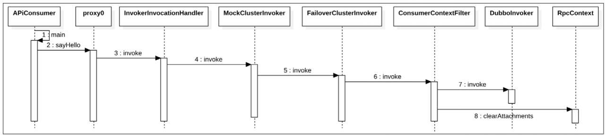
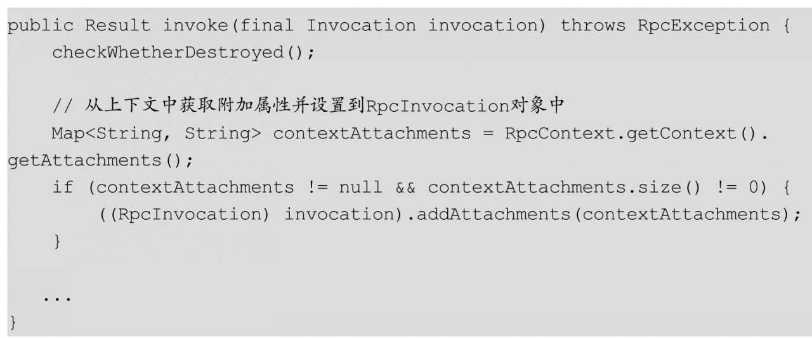
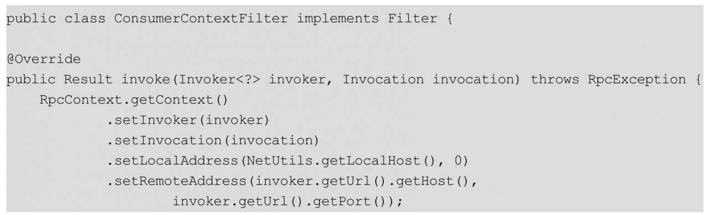
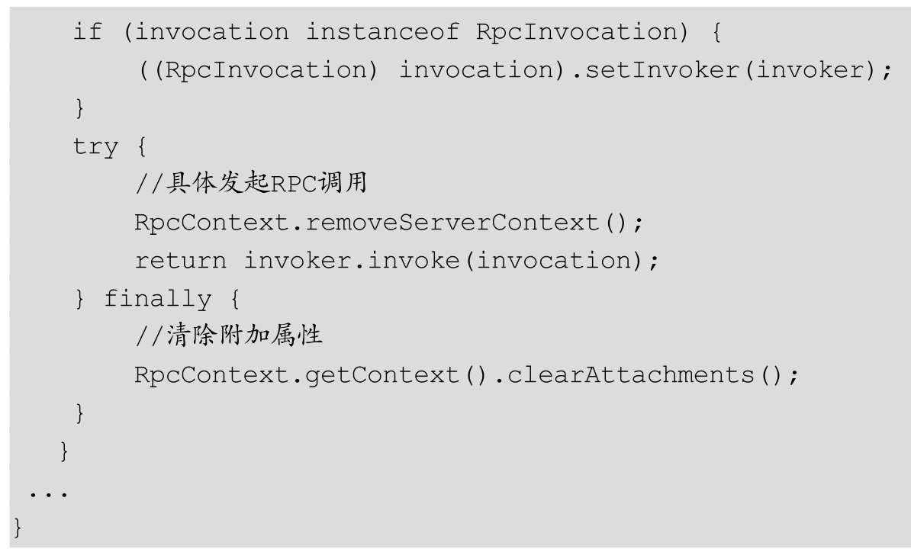
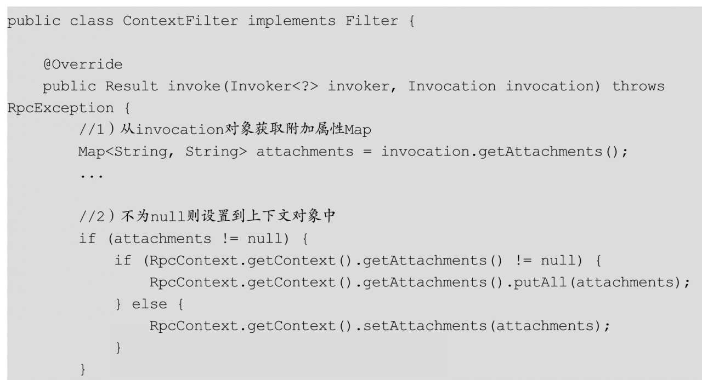
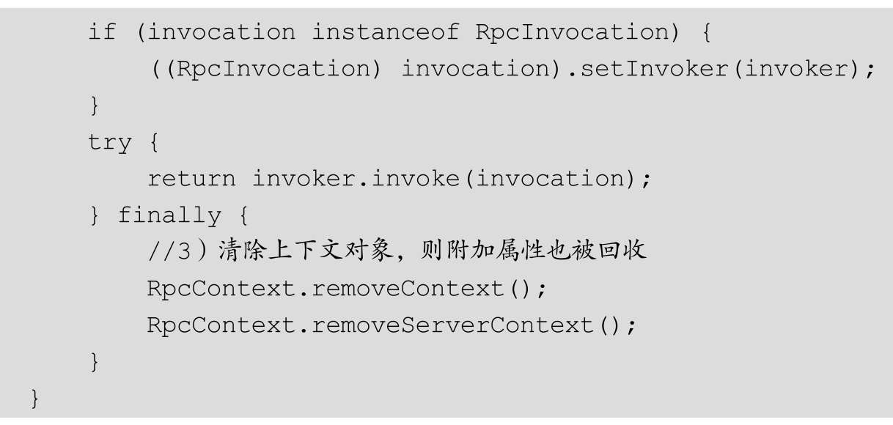

#Dubbo隐式参数传递
在基础篇中我们讲到Dubbo提供了隐式参数传递的功能，即服务调用方可以通过RpcContext.getContext（）.setAttachment（）方法设置附加属性键值对，然后设置的键值对可以在服务提供方服务方法内获取。

要实现隐式参数传递，首先需要在服务消费端的AbstractClusterInvoker类的invoke（）方法内，把附加属性键值对放入到RpcInvocation的attachments变量中，然后经过网络传递到服务提供端；服务提供端则使用ContextFilter对请求进行拦截，并从RpcInvocation中获取attachments中的键值对，然后使用RpcContext.getContext（）.setAttachment设置到上下文对象中，其模型图如图10.1所示：

##服务消费端AbstractClusterInvoker原理剖析
AbstractClusterInvoker是服务集群容错策略的抽象类，在默认情况下，集群容错策略为FailoverClusterInvoker，其继承了AbstractClusterInvoker，下面我们首先看看如图10.2所示的时序图：

从图中可以看到，服务消费端启动后最终会到达默认的集群容错策略FailoverClusterInvoker的invoke（）方法，其代码如下：

上面的代码从上下文中获取附加属性并设置到RpcInvocation对象中，另外RpcContext中的attachments是一个Map结构。

服务消费端什么时候会把里面设置的值清除掉呢？其实清除操作是在时序图中ConsumerContextFilter的invoke（）方法内完成的：

当请求发出去后，会清除当前与调用线程关联的线程变量里面的附加属性。

##服务提供方ContextFilter原理剖析
服务提供端接收请求后如何把隐式参数设置到上下文对象中，以便让服务提供方在服务方法内获取，服务提供端ContextFilter过滤器的激活时序与8.1节所讲的GenericFilter的激活时序一致，这里不再列出时序图，我们直接看ContextFilter的代码：

代码1首先从从invocation对象获取附加属性Map，代码2发现附加属性Map不为null，则添加附加属性到上下文对象的attachments对象里，这样在服务实现方法里就可以通过RpcContext.getContext（）.getAttachment来获取附加属性了。代码3等服务逻辑执行完毕后清除当前线程所关联的上下文对象，由于附加属性属于上下文对象，所以附加属性也会被回收。