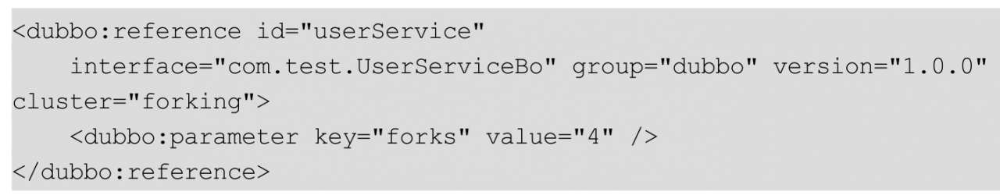
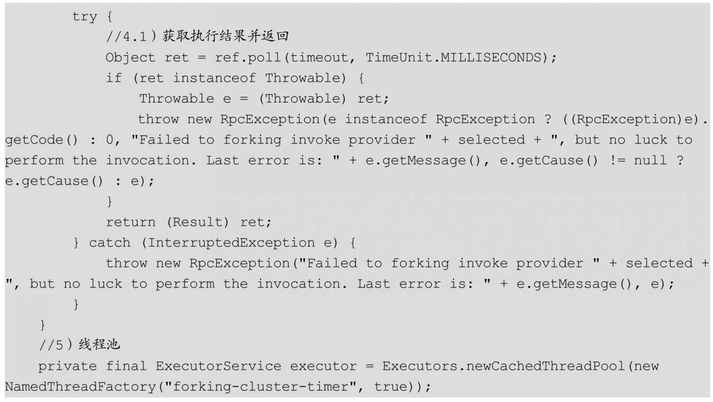
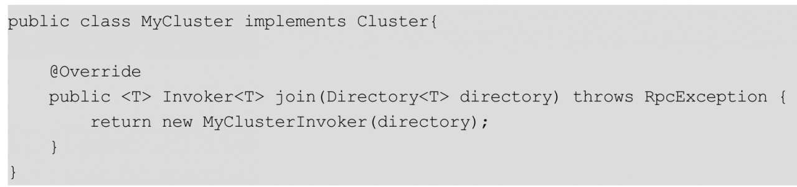
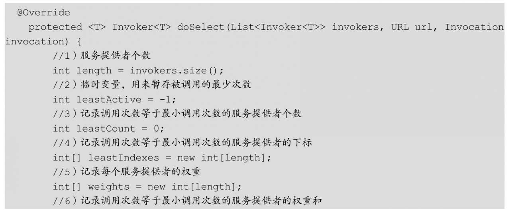

#Dubbo集群容错与负载均衡策略
##Dubbo集群容错策略概述
当我们进行系统设计时，不仅要考虑正常情况下代码逻辑应该如何走，还要考虑异常情况下代码逻辑应该怎么走。当服务消费方调用服务提供方的服务出现错误时，Dubbo提供了多种容错方案，默认模式为Failover Cluster，也就是失败重试。

下面让我们看看Dubbo提供的集群容错模式。

*  FailoverCluster：失败重试
  
  当服务消费方调用服务提供者失败后，会自动切换到其他服务提供者服务器进行重试，这通常用于读操作或者具有幂等的写操作。需要注意的是，重试会带来更长延迟。可以通过retries="2"来设置重试次数（不含第1次）。
  
  可以使用＜dubbo：reference retries="2"/＞来进行接口级别配置的重试次数，当服务消费方调用服务失败后，此例子会再重试两次，也就是说最多会做3次调用，这里的配置对该接口的所有方法生效。
  
当然你也可以针对某个方法配置重试次数，比如：

  

*   FailfastCluster：快速失败
   
   当服务消费方调用服务提供者失败后，立即报错，也就是只调用一次。通常，这种模式用于非幂等性的写操作。
*   FailsafeCluster：安全失败
   
   当服务消费者调用服务出现异常时，直接忽略异常。这种模式通常用于写入审计日志等操作。

*  FailbackCluster：失败自动恢复
  
  当服务消费端调用服务出现异常后，在后台记录失败的请求，并按照一定的策略后期再进行重试。这种模式通常用于消息通知操作。

*  ForkingCluster：并行调用
  
  当消费方调用一个接口方法后，Dubbo Client会并行调用多个服务提供者的服务，只要其中有一个成功即返回。这种模式通常用于实时性要求较高的读操作，但需要浪费更多服务资源。如下代码可通过forks="4"来设置最大并行数：
  

*  BroadcastCluster：广播调用
  
  当消费者调用一个接口方法后，Dubbo Client会逐个调用所有服务提供者，任意一台服务器调用异常则这次调用就标志失败。这种模式通常用于通知所有提供者更新缓存或日志等本地资源信息。
  
  我们了解到服务消费端具体调用的是集群容错策略的doInvoke（）方法，所以下面我们主要剖析几种比较常见的集群容错的doInvoke（）方法，并介绍一下如何自定义集群容错策略。在这里提醒一点，所有集群容错策略都是继承自抽象类AbstractClusterInvoker。
  
首先，我们来看看服务消费端发起远程调用的一个简化时序图：

图上是采用默认的FailOver集群容错方法时的调用时序图，从中可以看到，调用集群容错是在服务降级策略后进行的，集群容错FailoverClusterInvoker内部首先会调用父类AbstractClusterInvoker的list（）方法来获取invoker列表，即从RegistryDirectory管理的RouterChain的route（）方法中获取保存的invoker列表（参见第4章）。

###FailfastCluster策略源码分析
在Dubbo中，实现快速失败策略的是FailfastClusterInvoker类，这里我们看看具体实现，主要看看doInvoke（）方法的代码：

如果代码3发现代码2执行出错，则直接将异常抛给调用方，不进行任何补救措施。

###FailsafeCluster策略源码分析
在Dubbo中，实现失败安全的是FailsafeClusterInvoker类，这里我们看看具体实现，主要看看doInvoke（）方法的代码：

与Failfast的不同之处在于，该策略不会把异常抛给调用者。

###FailoverCluster策略源码分析
在Dubbo中，实现失败重试的是FailoverClusterInvoker类，这里我们看看具体实现，主要看看doInvoke（）方法的代码：

代码2从URL参数里获取设置的重试次数，如果用户没有设置重试次数，则取默认值，默认值是重试2次。这里需要注意的是，代码2将获取的配置重试次数又加1了，这说明总共调用次数=重试次数+1（1是正常调用），用户可以通过＜dubbo：reference retries="2"/＞设置重试次数。

代码3循环重试调用，如果第一次调用成功，则直接跳出循环返回，否则循环重试。在第一次调用时，不会运行代码3.1、代码3.2和代码3.3。如果第一次调用出现异常，则会循环，这时候i=1，所以会执行代码3.1以检查是否有线程调用了当前ReferenceConfig的destroy（）方法，销毁了当前消费者。如果当前消费者实例已经被销毁，那么重试就没意义了，所以会抛出RpcException异常。

如果当前消费者实例没有被销毁，则执行代码3.2以重新获取当前服务提供者列表，这是因为从第一次调开始到现在可能提供者列表已经变化了，获取列表后，执行代码3.2又进行了一次校验。如果校验通过，则执行代码3.4，以便根据负载均衡策略选择一个服务提供者，然后再次尝试调用。关于负载均衡策略的选择在下一节会做讲解。

###FailbackCluster策略源码分析
在Dubbo中，实现失败后定时重试的是FailbackClusterInvoker类，这里我们看看具体实现，主要看看doInvoke（）方法的代码：

代码1检查invokers是否合法，具体是看invokers是否为空，或者是否元素为0个，如果是，说明没有可用的服务提供者，则抛出异常。

代码2根据负载均衡策略选择一个invoker，并发起远程RPC调用。

如果执行代码1和代码2抛出了异常，则执行代码3，即把当前请求上下文添加到定时器后，将一个空的RpcResult返回调用方。其中addFailed（）方法的代码如下：

###ForkingCluster策略源码分析
在Dubbo中，实现并行调用的是ForkingClusterInvoker类，这里我们看看具体实现，主要看看doInvoke（）方法的代码：

代码1获取并行执行的参数，其中forks为并行执行的invoker个数，timeout为调用线程获取执行结果的超时时间（默认为1000ms），这个超时时间与下面配置的接口的timeout超时时间一致：

代码2根据设置的forks参数获取并行执行的invoker列表，如果forks参数值小于等于0或者大于服务提供者机器的个数，则设置forks为提供者机器个数。

代码3使用线程池让invoker列表中的invoker并发执行，执行完毕后会把返回结果放入并发安全的队列ref中。这里的count用来记录远程调用过程中出现异常的次数，如果异常次数大于等于forks参数值，则说明有forks个并发调用全部失败了，这时候将把异常放到并发安全的队列ref中。

代码4调用队列ref的poll（）方法，poll（）方法带有超时时间，并且当队列ref中含有元素或者超时时间到了的时候返回。代码3并发启动了forks个请求，只要有一个请求返回了，ref中就有元素了，这时poll（）方法就直接返回了远程调用的结果。如果forks个调用都失败了，由于远程调用过程的超时时间和poll（）方法的超时时间相同，并且远程调用是先发起的，那么这时poll（）方法会返回代码3.1里面设置的异常信息。

这里需要注意的是，即使代码4的poll返回了一个RPC调用的结果，其他并行的调用还是要继续进行的

###BroadcastCluster策略源码分析
在Dubbo中，实现广播调用的是BroadcastClusterInvoker类，这里我们看看具体实现，主要看看doInvoke（）方法的代码：

通过过上面的代码可知，广播调用是顺序轮询每个服务提供者进行调用的，其中返回给调用方的result为最后一次远程调用返回的结果。

###如何基于扩展接口自定义集群容错策略
Dubbo本身提供了丰富的集群容错策略，但是如果你有定制化需求，可以根据Dubbo提供的扩展接口Cluster进行定制。

为了自定义扩展实现，首先需要实现Cluster接口：

在上面的代码中，MyCluster实现了Cluster的join接口。

然后，需要集成AbstractClusterInvoker类创建自己的ClusterInvoker类：

通过上面的代码可知，doInvoke方法需要重写，在该方法内用户就可以实现自己的集群容错策略。

然后，在org.apache.dubbo.rpc.cluster.Cluster目录下创建文件，并在文件里添加myCluster=org.apache.dubbo.demo.cluster.MyCluster，如图6.2所示：

最后，使用下面的方法将集群容错模式切换为myCluster：

##Dubbo负载均衡策略概述
当服务提供方是集群时，为了避免大量请求一直集中在一个或者几个服务提供方机器上，从而使这些机器负载很高，甚至导致服务不可用，需要做一定的负载均衡策略。Dubbo提供了多种均衡策略，默认为random，也就是每次随机调用一台服务提供者的服务。

Dubbo提供的负载均衡策略有如下几种。
*  RandomLoadBalance：随机策略。按照概率设置权重，比较均匀，并且可以动态调节提供者的权重。
*  RoundRobinLoadBalance：轮循策略。轮循，按公约后的权重设置轮循比率。会存在执行比较慢的服务提供者堆积请求的情况，比如一个机器执行得非常慢，但是机器没有宕机（如果宕机了，那么当前机器会从ZooKeeper的服务列表中删除），当很多新的请求到达该机器后，由于之前的请求还没处理完，会导致新的请求被堆积，久而久之，消费者调用这台机器上的所有请求都会被阻塞。
*  LeastActiveLoadBalance：最少活跃调用数。如果每个提供者的活跃数相同，则随机选择一个。在每个服务提供者里维护着一个活跃数计数器，用来记录当前同时处理请求的个数，也就是并发处理任务的个数。这个值越小，说明当前服务提供者处理的速度越快或者当前机器的负载比较低，所以路由选择时就选择该活跃度最底的机器。如果一个服务提供者处理速度很慢，由于堆积，那么同时处理的请求就比较多，也就是说活跃调用数目较大（活跃度较高），这时，处理速度慢的提供者将收到更少的请求。
*  ConsistentHashLoadBalance一致性Hash策略。一致性Hash，可以保证相同参数的请求总是发到同一提供者，当某一台提供者机器宕机时，原本发往该提供者的请求，将基于虚拟节点平摊给其他提供者，这样就不会引起剧烈变动。
  
如上所述，Dubbo提供了丰富的负载均衡策略，但是如果你有定制化需求，可以基于Dubbo提供的扩展接口LoadBalance进行定制。
  
**AbstractLoadBalance**实现了LoadBalance接口，上面的各种负载均衡策略实际上就是继承了AbstractLoadBalance方法，但重写了其doSelect（）方法，所以下面我们重点看看每种负载均衡策略的doSelect（）方法。
  
我们先看看从消费端发起请求到处理负载均衡的时序图，如图6.3所示：

从图6.3可以看到，消费端发起远程调用后会先经过步骤4进行服务降级检查，如果发现没有设置降级策略，则会执行步骤5进入集群容错invoker，其内部会先执行步骤6，以便从RegistryDirectory里获取经过服务路由规则过滤后的服务提供者的invokers列表。然后，执行步骤8～步骤11，以便根据具体负载均衡策略从invoker列表中选择一个invoker，最后使用所选的invoker，执行步骤12以发起远程调用。

###RandomLoadBalance策略源码分析
在Dubbo中，实现随机选择策略的是RandomLoadBalance类，这里我们看看具体实现，主要看看doSelect（）方法的代码：

代码1计算服务提供者总个数，也就是服务提供者集群中有多少机器在提供该服务。

代码2创建一个变量，用来标识所有服务提供者的权重是否都是一样的。

代码3创建一个数组，用来保存所有服务提供者设置的权重。

代码4计算第一个服务提供者的权重，并保存到数组中。

代码5累加所有服务提供者设置的权重，并且记录所有服务提供者的权重是否都是一样的，如果不一样则将sameWeight设置为false。

在代码8中，如果所有服务提供者权重都一样，则使用ThreadLocalRandom.current（）.nextInt（length）从所有服务提供者里随机选择一个服务提供者进行调用。需要注意的是，这里没有使用Random而是使用了ThreadLocalRandom，这是出于性能上的考虑，因为Random在高并发下会导致大量线程竞争同一个原子变量，导致大量线程原地自旋，从而浪费CPU资源（参见笔者编写的《Java并发编程之美》一书）。

在代码7中，如果所有服务提供者权重不一样，那么在正常情况下应该选择权重最大的提供者来提供服务，但是Dubbo还考虑到另外一个因素，就是服务预热时间。如果服务提供者A的权重比服务提供者B的权重大，但服务提供者A是刚启动的，而服务提供者B已经服务了一些时间，则这时候Dubbo会选择服务提供者B而不是服务提供者A来进行调用。为此，我们可以看看计算权重的getWeight（）方法的代码：

代码6.1获取用户对该服务提供者设置的权重，默认情况下权重都是100。

代码6.2获取该服务提供者发布服务时的时间timestamp。

代码6.3计算该服务已经发布了多少时间。

代码6.4获取用户设置的该服务的预热时间，默认是10分钟。

在代码6.5中，如果该服务提供者还没过预热期，则让该服务提供者的预热时间参与计算权重calculateWarmupWeight：

上面代码中的int ww=（int）（（float）uptime/（（float）warmup/（float）weight））；等价于int ww=（int）（（float）uptime/（float）warmup*（float）weight）；，也就是说如果当前服务提供者还没过预热期，则用户设置的权重将通过（float）uptime/（float）warmup打折扣。如果一个服务提供者设置的权重很大，但是还没过预热时间，那么重新计算出来的权重就比实际的小。

如果服务提供者已经过了预热期，则这时就会按照用户设置的权重的大小来选择使用哪个服务提供者。

###RoundRobinLoadBalance策略源码分析
在Dubbo中，实现轮询选择策略的是RoundRobinLoadBalance类，这里我们看看具体实现，主要看看doSelect（）方法的代码：

###LeastActiveLoadBalance策略源码分析
在Dubbo中，实现最少活跃调用策略的是LeastActiveLoadBalance类，这里我们看看具体实现，主要看看doSelect（）方法的代码：

代码1～代码8初始化一系列的变量。

代码9遍历所有服务提供者，过滤出所有的调用次数等于最小调用次数的服务提供者，其中代码9.1获取当前服务提供者被调用的次数，代码9.2计算当前服务提供者的权重（默认为100），代码9.3保存当前服务提供者的权重，代码9.4和代码9.5则是计算出最小被调用的次数。由于等于最小被调用次数的服务提供者可能不止一个，所以这里把所有等于最小被调用次数的服务提供者记录到leastIndexes数组中，并且，如果发现这些服务提供者的权重不是一样的，则设置标记sameWeight。

在代码10中，如果只有一个最小调用次数的服务提供者，则直接返回。

在代码11中，如果最小调用次数的invoker有多个并且权重不一样，则使用随机选择策略中的方法来选择一个。

在代码12中，如果最小调用次数的invoker有多个并且权重一样，则随机选择一个。这里需要注意的是，在2.5.*版本里使用的是单例的Random来生成随机变量，这里替换为ThreadLocalRandom是为了减少高并发下Random导致CAS自旋带来的性能开销。

###ConsistentHashLoadBalance策略源码分析
一致性Hash负载均衡策略原理：

在分布式系统中，负载均衡的问题可以使用Hash算法让固定的一部分请求落到同一台服务器上，这样每台服务器就会固定处理一部分请求（并维护这些请求的信息），从而起到负载均衡的作用。

但是普通的余数Hash（用户ID）算法伸缩性很差，当新增或者下线服务器机器时，用户ID与服务器的映射关系会大量失效。一致性Hash则利用Hash环对其进行了改进。

一致性Hash的特性：
- 单调性（Monotonicity）：单调性是指如果已经有一些请求通过Hash分派到了相应的服务器进行处理，当又有新的服务器加入到系统中时，应保证原有的请求可以被映射到原有的或者新增的服务器上，而不会被映射到原来的其他服务器上。这一点通过上面新增的服务器IP5就可以证明，在新增了IP5后，原来被IP1处理的user6现在还是被IP1处理，原来被IP1处理的user5现在被新增的IP5处理。
- 分散性（Spread）：在分布式环境中，当客户端请求时可能不知道所有服务器的存在，可能只知道其中一部分服务器，从客户端看来，它看到的部分服务器会形成一个完整的Hash环。如果多个客户端都把部分服务器作为一个完整Hash环，那么可能会导致同一个用户的请求被路由到不同的服务器进行处理。这种情况显然是应该避免的，因为它不能保证同一个用户的请求落到同一台服务器。所谓分散性是指上述情况发生的严重程度。
- 平衡性（Balance）：平衡性也就是指负载均衡，是指客户端Hash后的请求应该能够分散到不同的服务器上。一致性Hash可以做到每个服务器都进行处理请求，但是不能保证每个服务器处理的请求的数量大致相同，如图6.14所示
  

服务器IP1、IP2、IP3经过Hash后落到了一致性Hash环上，从图中Hash值的分布可知，IP1会负责处理大概80%的请求，而IP2和IP3则只会负责处理大概20%的请求，虽然三个机器都在处理请求，但明显每个机器的负载不均衡，这样称为一致性Hash的倾斜，虚拟节点的出现就是为了解决这个问题。

虚拟节点：

当服务器节点比较少的时候会出现上面所说的一致性Hash倾斜问题，一种解决方法是多加机器，但加机器是有成本的，那么就加虚拟节点，比如上面三台机器，每台机器引入1个虚拟节点后的一致性Hash环如图6.15所示：

图中的IP1-1是IP1的虚拟节点，IP2-1是IP2的虚拟节点，IP3-1是IP3的虚拟节点。

当物理机器数目为M，虚拟节点为N的时候，实际Hash环上节点个数为M*（N+1）。

**在Dubbo中，实现一致性Hash策略的是ConsistentHashLoadBalance类，这里我们看看具体实现，主要看看doSelect（）方法的代码：**

在上面的代码中，一致性Hash策略主要是ConsistentHashSelector类实现，其构造函数如下：

这里主要是根据所有服务提供者的invoker列表，生成从Hash环上的节点到服务提供者机器的映射关系，并存放到virtualInvokers中，具体的算法介绍可参见[https://en.wikipedia.org/wiki/Consistent_hashing]。

当调用方调用服务时，就是调用ConsistentHashSelector的select（）方法来选择一个服务提供者：

代码1获取参与一致性Hash算法的key，默认是第一个参数，消费端可以设置hash.arguments指定哪几个参数参与计算。

代码2根据具体算法计算该key对应md5值。

代码3计算该key对应Hash环上哪一个点，并选择该点对应的服务提供者。

##如何基于扩展接口自定义负载均衡策略
Dubbo本身提供了丰富的负载均衡策略，但是如果你有定制化需求，则可以根据Dubbo提供的扩展接口LoadBalance进行定制。

自定义扩展实现，首先需要实现LoadBalance接口，由于Dubbo本身提供了一个抽象类AbstractLoadBalance，所以我们可以直接继承该类：

在上面的代码中，MyLoadBalance实现了LoadBalance的doSelect接口。

然后，在org.apache.dubbo.rpc.cluster.LoadBalance目录下创建文件，并在文件里添加myLoadBalance=com.books.dubbo.demo.loadbalance.MyLoadBalance，如图6.18所示：

最后，使用如下方法将负载均衡模式切换为myLoadBalance：
