#内核原理剖析
###1. 服务提供者暴露一个服务过程
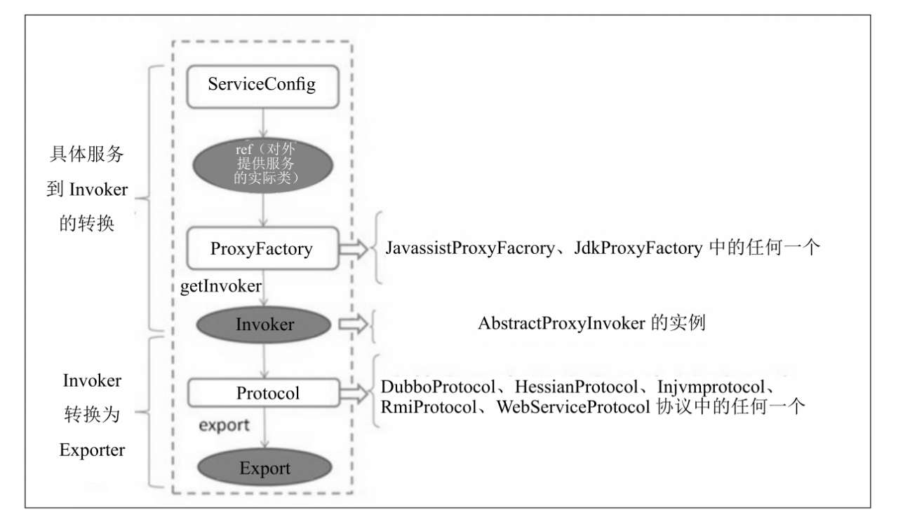

###2. 服务消费者消费一个服务过程
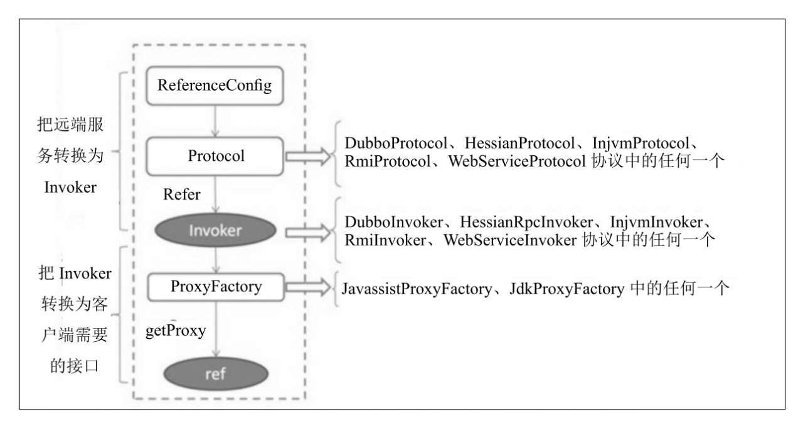

###3. dubbo适配器原理
动态编译技术为接口Protocol生成一个适配器类Protocol$Adaptive的对象实例，在Dubbo框架中需要使用Protocol的实例时，实际上就是使用Protocol$Adaptive的对象实例来获取具体的SPI实现类的
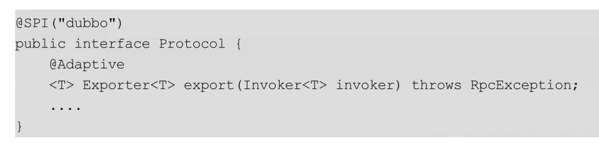

在Dubbo框架中，protocol的定义为：private static final Protocol protocol=ExtensionLoader.getExtensionLoader（Protocol.class）.getAdaptiveExtension（）；

当调用protocol.export（wrapperInvoker）时，实际是调用Protocol$Adaptive的对象实例的export（）方法，然后后者根据wrapperInvoker中URL里面的协议类型参数执行；

代码2使用Dubbo增强SPI方法getExtension（）获取对应的SPI实现类，然后调用代码3来执行具体SPI实现类的export（）方法。
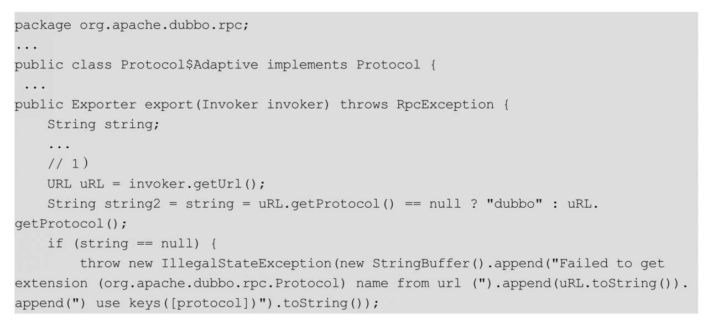
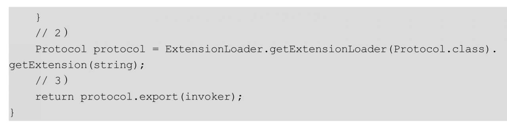

适配器类Protocol$Adaptive会根据传递的协议参数的不同，加载不同的Protocol的SPI实现，其实在Dubbo框架中，框架会给每个SPI扩展接口动态生成一个对应的适配器类，并根据参数来使用增强SPI以选择不同的SPI实现

###4. dubbo的动态编译原理
Java程序要想运行首先需要使用javac把源代码编译为class字节码文件，然后使用JVM把class字节码文件加载到内存创建Class对象后，使用Class对象创建对象实例，

在Dubbo框架中框架会给每个SPI扩展接口动态生成一个对应的适配器类，那么如何生成呢？这里就使用了动态编译技术，在Dubbo中提供了一个Compiler的SPI
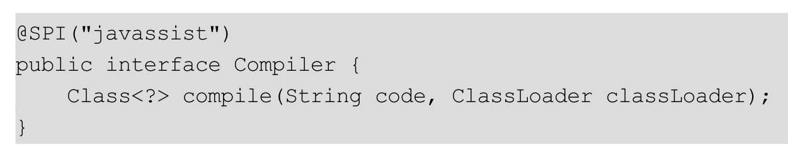

Dubbo提供Compiler的实现有JavassistCompiler（默认实现）和JdkCompiler两种。

这里我们从Dubbo框架如何使用动态编译生成扩展接口对应的适配器类入手，首先我们打开ExtensionLoader的createAdaptiveExtensionClass（）方法，就是该方法将源文件动态编译为Class对象的，有了Class对象后，我们就可以使用newInstance（）方法创建对象实例了

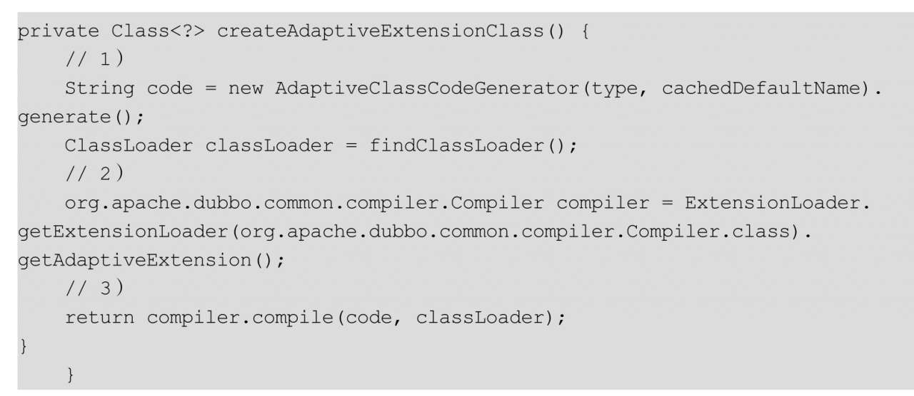

代码1是根据SPI扩展接口生成其对应的适配器类的源码，其返回的是一个字符串，比如对于Protocol扩展接口来说，**`返回的字符串内容`**为：如下图

代码2使用增强SPI选择扩展接口Compiler的实现，这里默认为JavassistCompiler，然后代码3调用JavassistCompiler的compile（）方法并根据源代码生成Protocol$Adaptive的Class对象。
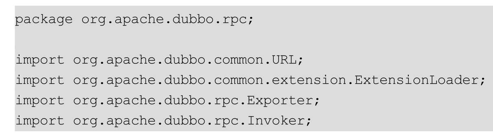
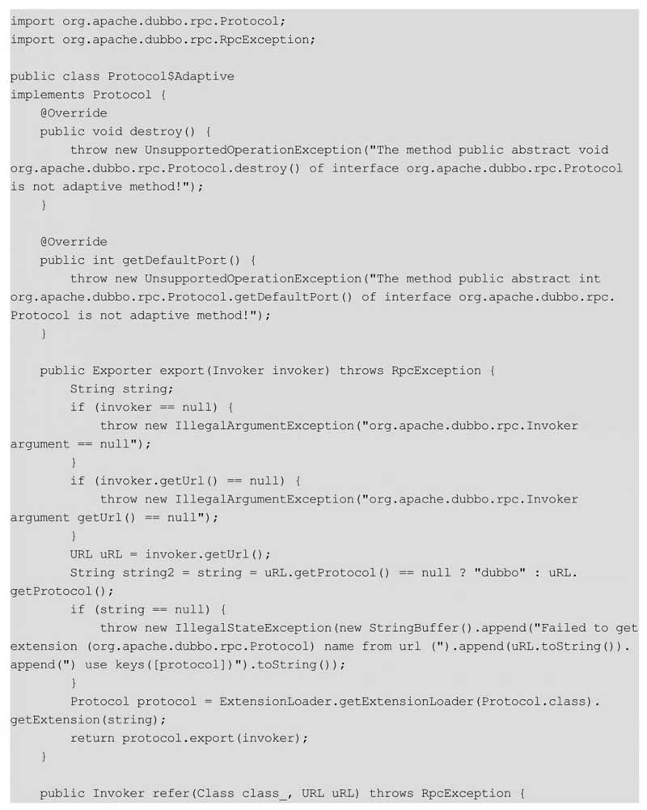
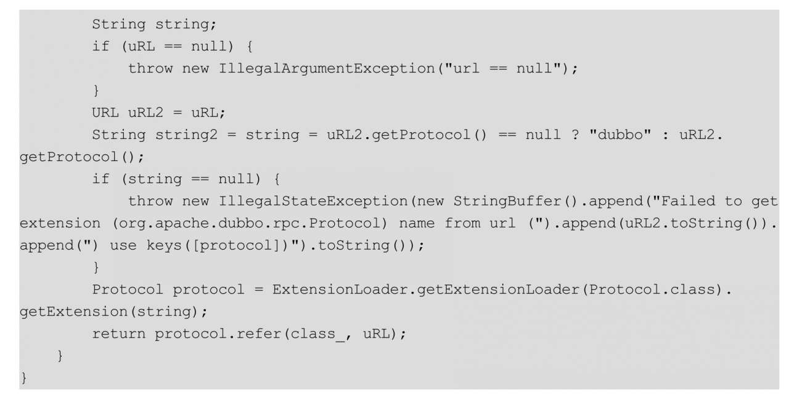

###5. dubbo增强SPI
前面我们讲解了Dubbo框架如何使用动态编译技术给每个扩展接口生成适配器类，并讲解了适配器类根据其中的参数来选择对应的SPI实现，下面我们讲解在适配器类中是如何根据参数来装载具体的SPI实现的。

Dubbo的扩展点加载机制是基于JDK标准的SPI扩展机制增强而来的，Dubbo解决了JDK标准的SPI的以下问题：
- JDK标准的SPI会一次性实例化扩展点的所有实现，如果有些扩展实现初始化很耗时，但又没用上，那么加载就很浪费资源。
- 如果扩展点加载失败，是不会友好地向用户通知具体异常的。比如：对于JDK标准的ScriptEngine来说，如果Ruby ScriptEngine因为所依赖的jruby.jar不存在，导致Ruby ScriptEngine类加载失败，那么这个失败原因就被隐藏了，当用户执行Ruby脚本时，会报空指针异常，而不是报Ruby ScriptEngine不存在。
- 增加了对扩展点IoC和AOP的支持，一个扩展点可以直接使用setter（）方法注入其他扩展点，也可以对扩展点使用Wrapper类进行功能增强。

我们结合服务提供者配置类ServiceConfig来讲解如何使用增强SPI加载扩展接口Protocol的实现类，在ServiceConfig类中，有如下代码：
  
  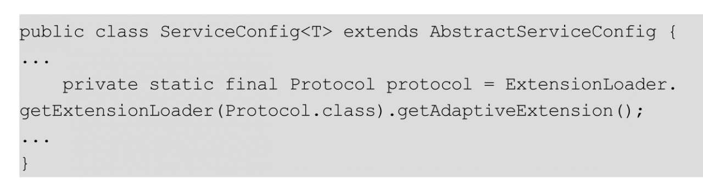
  
这里的ExtensionLoader类似JDK标准SPI里的ServiceLoader类，代码ExtensionLoader.getExtensionLoader（Protocol.class）.getAdaptiveExtension（）的作用是获取Protocol接口的适配器类，在Dubbo中每个扩展接口都有一个对应的适配器类，前面所述这个适配器类是动态生成的一个类，这里我们给出Protocol扩展接口对应的适配器类的代码:
  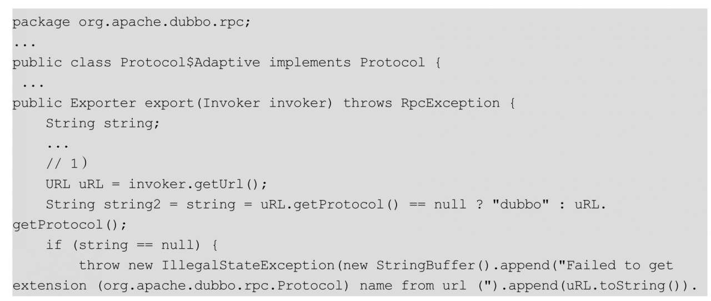
  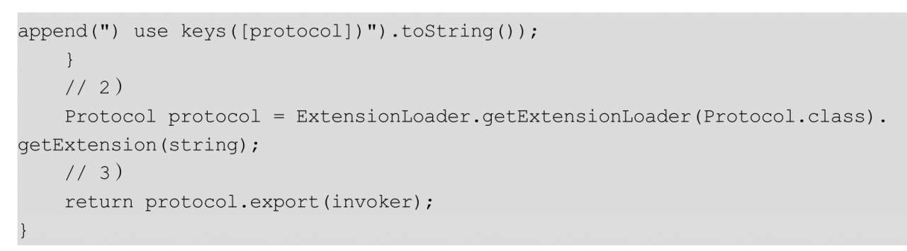

所以当我们调用protocol.export（invoker）方法的时候实际调用的是动态生成的Protocol$Adaptive实例的export（invoker）方法。
其内部代码1首先获取参数里的URL对象，然后从URL对象里获取用户设置的协议（Protocol）的实现类的名称，然后调用代码2根据名称获取具体的Protocol协议的实现类（后面我们会知道获取的是被使用Wrapper类增强后的实现类），最后代码3具体调用Protocol协议的实现类的export（invoker）方法。
结合时序图（见图2.5）来讲解ExtensionLoader的getAdaptiveExtension（）方法是如何动态生成扩展接口对应的适配器类，以及getExtension（）方法如何根据扩展实现类的名称找到对应的扩展实现类的：
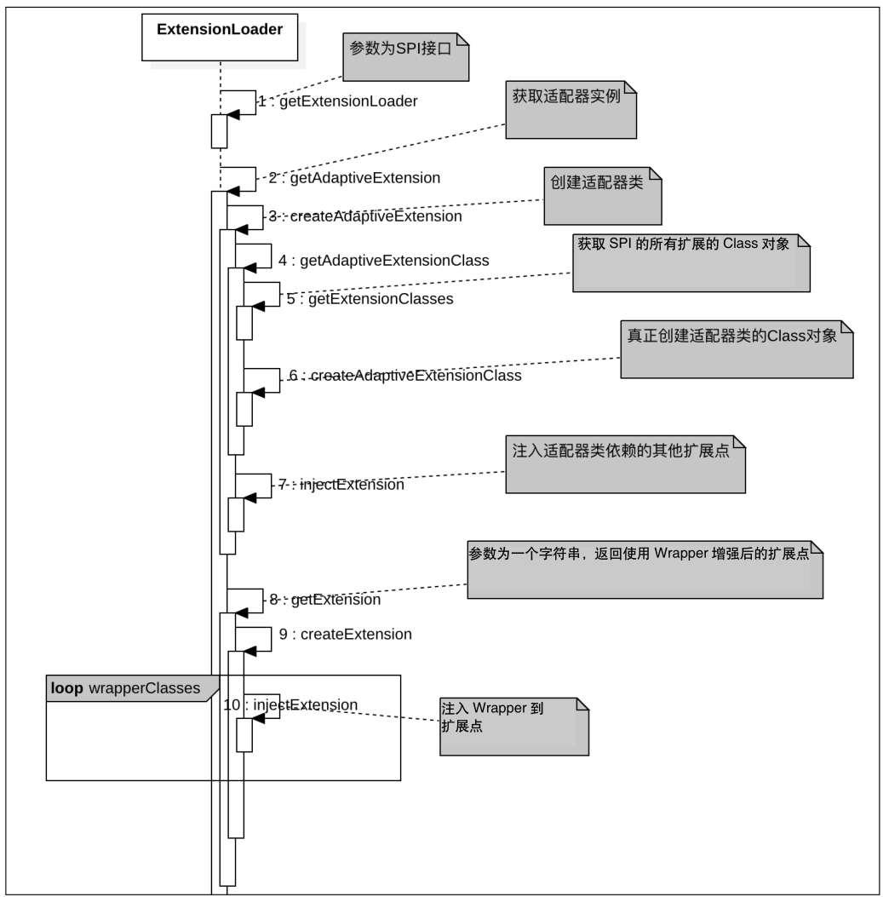

至此，如何使用getExtension（String name）方法加载具体的扩展实现类也讲完了。上面我们讲解的getExtension（String name）方法只会加载某一个扩展接口实现的Class对象的实例。
但在有些情况下我们需要全部创建，比如ProtocolFilterWrapper类中的buildInvokerChain（）方法在建立Filter责任链时，需要把属于某一个group的所有Filter都放到责任链里，其是通过如下方式来获取属于某个组的Filter扩展实现类的：

比如，当服务提供端启动时只会加载group为provider的Filter扩展实现类：
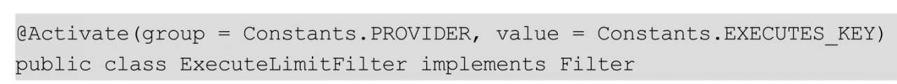

当消费端启动时只会加载group为consumer的Filter扩展实现类：
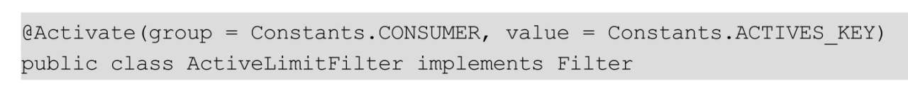

另外还需要注意，并不是所有属于某个group的Filter都会被加载，还需要看其设置的value的值是否在URL里（用户是否设置了该value的属性），比如ActiveLimitFilter在默认情况下是不会在服务消费端加载到Filter链的，只有当消费端设置了并发活跃数actives属性时才会（设置后actives属性就会出现在URL里了）。
我们以加载Filter为例看看getActivateExtension（）方法的实现原理：
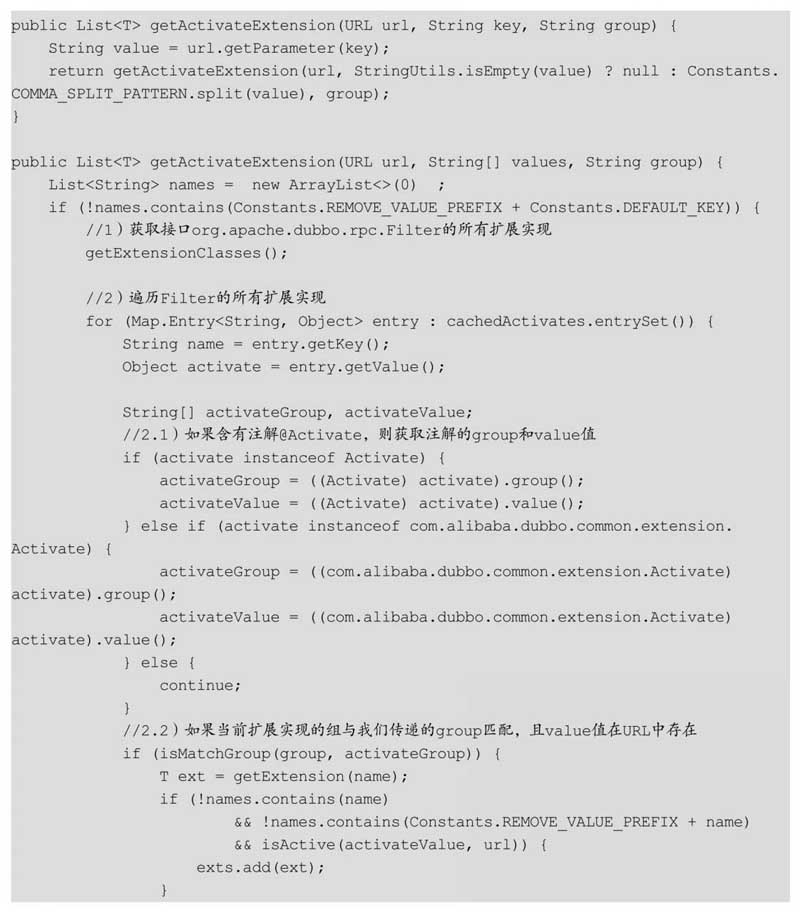
* 扩展点的自动包装

在Spring AOP中，我们可以使用多个切面对指定类的方法进行增强，在Dubbo中也提供了类似的功能。在Dubbo中你可以指定多个Wrapper类对指定的扩展点的实现类的方法进行增强。
  当执行protocol.export（wrapperInvoker）方法时，实际调用的是适配器Protocol$Adaptive的export（）方法，如果URL对象里面的protocol为dubbo，那么在没有扩展点自动包装时，protocol.export（）方法返回的就是DubboProtocol的对象。
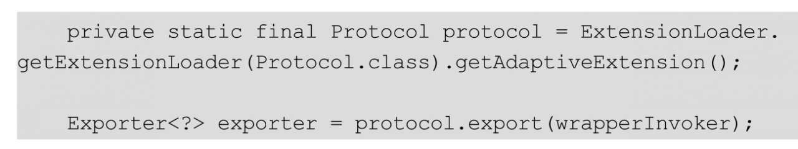

而在真正的情况下，Dubbo里使用ProtocolFilterWrapper、ProtocolListenerWrapper等Wrapper类对DubboProtocol对象进行包装增强。
ProtocolFilterWrapper、ProtocolListenerWrapper、DubboProtocol三个类都有一个拷贝构造函数，这个拷贝构造函数的参数就是扩展接口Protocol。所谓包装，其含义如下：
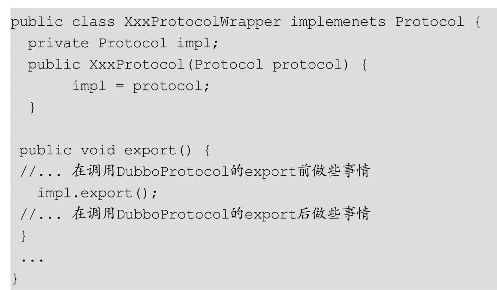

比如这里会进行两次包装，第一次首先使用ProtocolListenerWrapper类对DubboProtocol进行包装，这时ProtocolListenerWrapper类里的impl就是DubboProtocol，然后第二次使用ProtocolFilterWrapper对ProtocolListenerWrapper进行包装，也就是说ProtocolFilterWrapper里的impl是ProtocolListenerWrapper，这时会调用适配器Protocol$Adaptive的export（）方法，如果URL对象里面的protocol为dubbo，那么在扩展点自动包装时，protocol.export返回的就是ProtocolFilterWrapper的实例了。

###6. dubbo使用JavaAssist减少反射调用开销
Dubbo会给每个服务提供者的实现类生产一个Wrapper类，这个Wrapper类里面最终调用服务提供者的接口实现类，Wrapper类的存在是为了减少反射的调用。

当服务提供方收到消费方发来的请求后，需要根据消费者传递过来的方法名和参数反射调用服务提供者的实现类，而反射本身是有性能开销的，Dubbo把每个服务提供者的实现类通过JavaAssist包装为一个Wrapper类以减少反射调用开销。那么Wrapper类为何能减少反射调用呢？
假设我们的服务提供方实现类为GreetingServiceImpl，其代码如下:
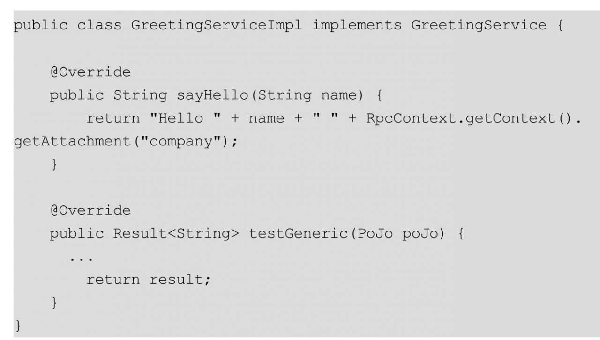

那么其对应的Wrapper类的源码如下:

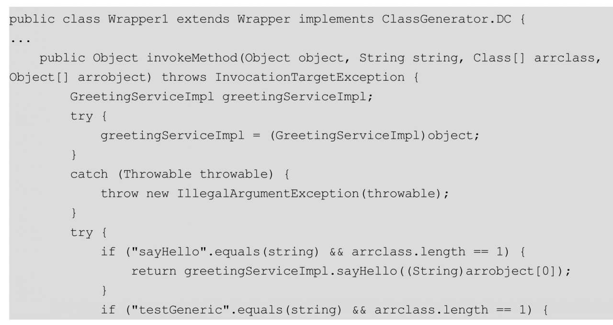
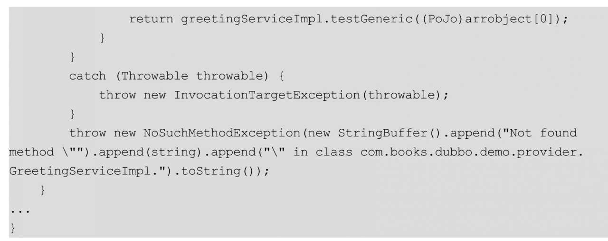

通过上面的代码可知，Wrapper1类的invokeMethod最终直接调用的是GreetingServiceImpl的具体方法，这就避免了反射开销，而Wrapper1类是在Dubbo服务启动时生成的，所以不会对运行时带来开销。
下面我们看看Dubbo是在哪里生成Wrapper类的。在Dubbo分层架构概述中，我们讲过Proxy层的SPI扩展接口为ProxyFactory，Dubbo提供的实现主要有JavassistProxyFactory（默认使用）和JdkProxyFactory，其实就是JavassistProxyFactory为每个服务提供者实现类生成了Wrapper类：

###7. JDK标准SPI
Dubbo增强的SPI功能是从JDK标准SPI演化而来的，所以有必要先讲讲标准SPI的原理。

JDK中的SPI是面向接口编程的，服务规则提供者会在JRE的核心API里提供服务访问接口，而具体实现则由其他开发商提供。
例如，如果规范制定者在rt.jar包里定义了数据库的驱动接口java.sql.Driver，那么MySQL实现的开发商则会在MySQL的驱动包的META-INF/services文件夹下建立名称为java.sql.Driver的文件，文件内容就是MySQL对java.sql.Driver接口的实现类，如图2.4所示

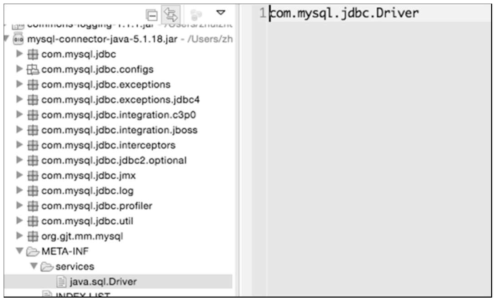

通过如下代码可知，com.mysql.jdbc.Driver实现了java.sql.Driver接口:

上面讲解了如何使用SPI扩展自定义自己的实现，下面说说SPI的实现原理。
我们知道Java核心API（比如rt.jar包）是使用Bootstrap ClassLoader类加载器加载的，而用户提供的Jar包是由AppClassLoader加载的。如果一个类由类加载器加载，那么这个类依赖的类也是由相同的类加载器加载的。
用来搜索开发商提供的SPI扩展实现类的API类（ServiceLoader）是使用Bootstrap ClassLoader加载的，那么ServiceLoader里面依赖的类应该也是由Bootstrap ClassLoader加载的。而上面说了用户提供的包含SPI实现类的Jar包是由AppClassLoader加载的，所以这就需要一种违反双亲委派模型的方法，线程上下文类加载器ContextClassLoader就是用来解决这个问题的。
下面我们写一段测试代码，看看具体是如何工作的。

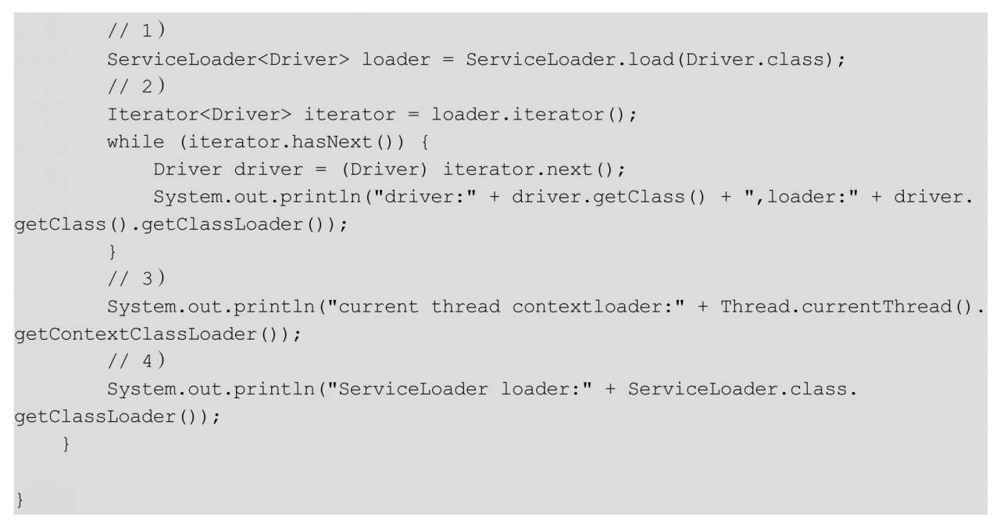

然后引入MySQL驱动的Jar包，执行结果如下。
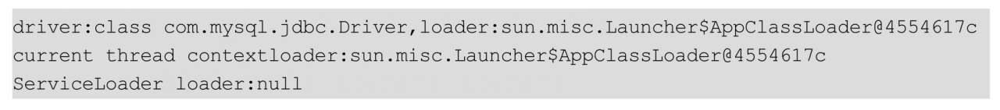

从结果可知找到了MySQL的驱动，如果在引入Oracle数据库驱动的Jar包后再运行，则输出会显示找到了MySQL和Oracle的驱动，这也说明了JDK标准的SPI会同时把SPI接口的所有实现类提前加载好实例。
另外，从执行结果可以知道ServiceLoader的加载器为Bootstarp，因为这里输出了null，并且从该类在rt.jar里面这一点也可以证明。
下面我们看看ServiceLoader的load（）方法源码

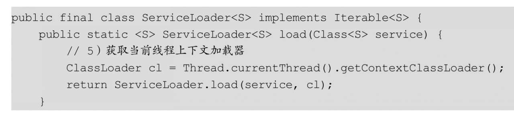
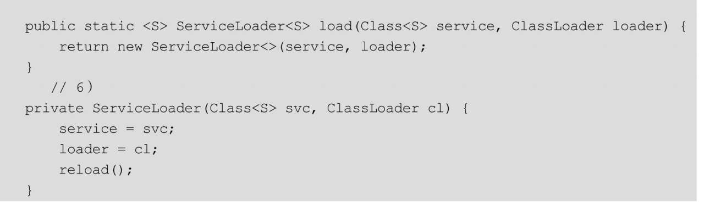

代码5获取了当前线程上下文加载器，这里是AppClassLoader。

代码6将该类加载器传递给新构造的ServiceLoader的成员变量loader。那么这个loader在什么时候使用呢？下面我们看看LazyIterator的next（）方法
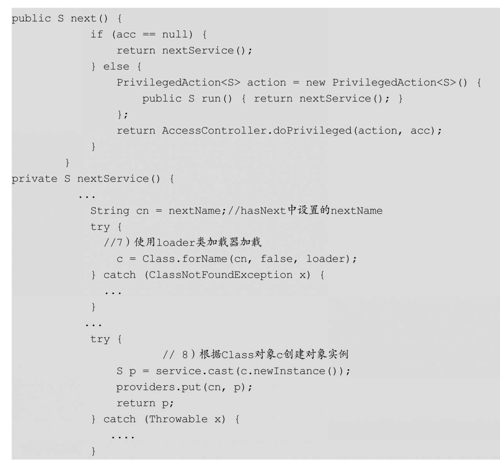

代码7使用loader也就是AppClassLoader加载具体的驱动实现类的Class对象，代码8则使用Class对象调用newInstance（）方法来创建对象实例。至于cn是怎么来的，读者可以参见LazyIterator的hasNext（）方法：
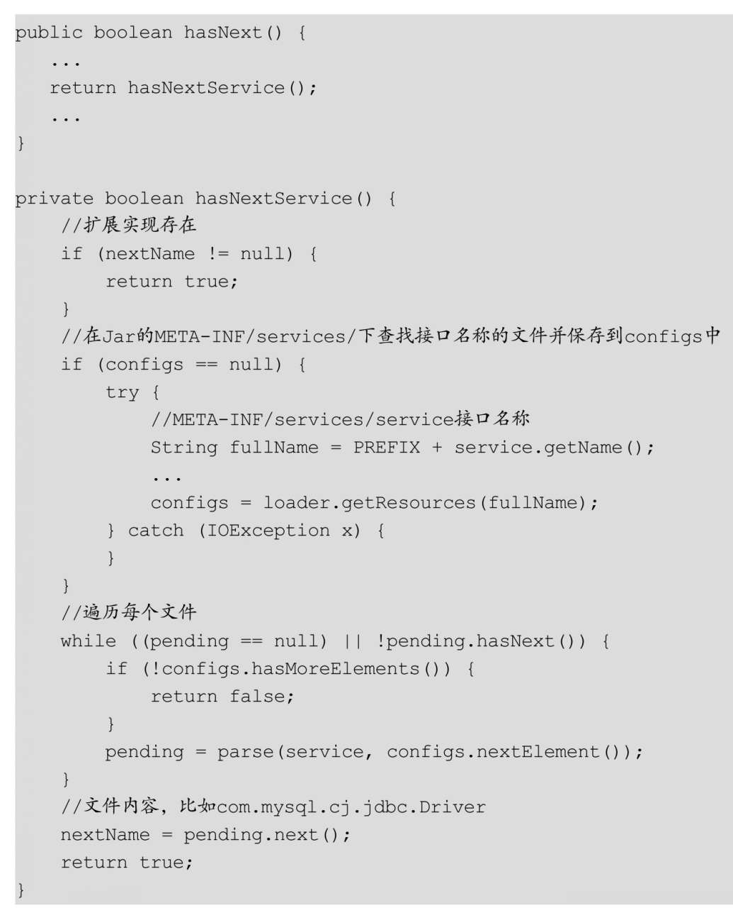