#本地服务暴露与引用原理
前面的第3章我们讲解了远程服务暴露与引用的流程，这种方式是提供方与消费方通过网络来进行通信的，如图12.1所示。

其实Dubbo还提供了一种本地服务暴露与引用的方式，在同一个JVM进程中同时发布与调用同一个服务时，这种方式显得比较重要，因为如果当前JVM内要调用的服务在本JVM进程内已有，则避免了一次远程过程调用，而是直接在JVM内进行通信，如图12.2所示。

##本地服务暴露流程
本地导出使用了injvm协议，这是一个伪协议，它不开启端口，不发起远程调用，只在JVM内直接关联，但执行Dubbo的Filter链。

首先，我们通过时序图看看本地服务暴露流程，如图12.3所示
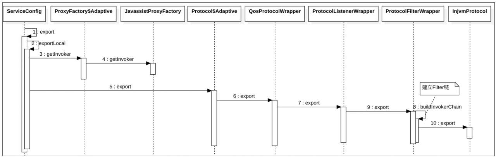

我们看看ServiceConfig的exportLocal方法是怎么导出服务的：
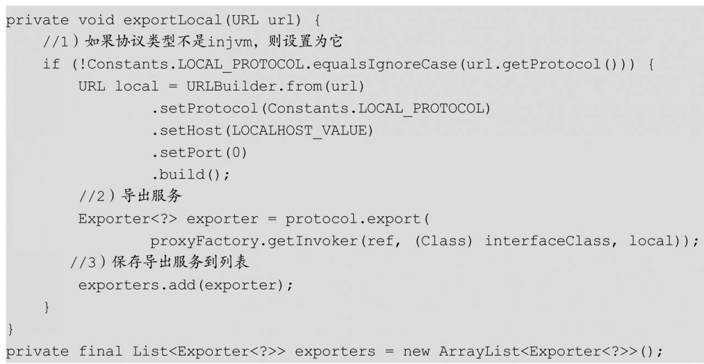

在代码1中，如果发现协议类型不是injvm，则创建一个新的URL对象，并且设置协议为injvm，然后设置Host为127.0.0.1，端口为0。

后面就是与远程服务暴露一样的流程。首先，调用proxyFactory.getInvoker获取代理的对象，其中的proxyFactory也是适配器类，默认ProxyFactory的扩展实现是JavassistProxyFactory，所以这里调用JavassistProxyFactory的getInvoker（）方法来获取代理服务实现类的invoker类。

然后，调用protocol.export导出服务，其中的protocol也是扩展接口，这里与远程服务暴露不同之处在于协议类型为injvm，所以会加载扩展实现类InjvmProtocol。由图12.3可知，InjvmProtocol也使用Wrapper类被增强了，并且在ProtocolFilterWrapper内也建立了Filter链。

需要注意的是，在InjvmProtocol内有一个static类型的private static InjvmProtocol INSTANCE，而在InjvmProtocol的构造函数内把当前对象赋值给了INSTANCE：
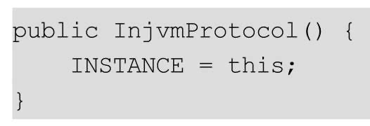

另外，由于增强SPI内会缓存每个扩展接口实现的Class对象，所以在整个JVM内对于每个扩展接口来说只会存在一个InjvmProtocol的实例，并且其中INSTANCE保存的就是这个实例对象。

下面我们看看InjvmProtocol的export（）方法做了什么：
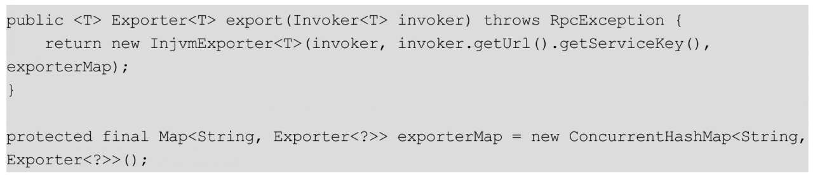

在上面的代码中，export（）方法返回了一个InjvmExporter对象，并保存了InjvmProtocol中的exporterMap变量，而InjvmExporter的构造函数为：
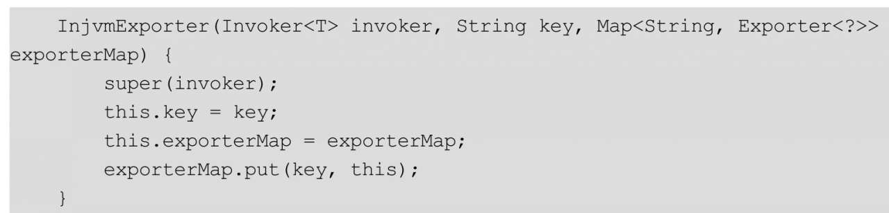

这里的key为服务key，比如对服务com.books.dubbo.demo.api.GreetingService来说，其key为dubbo/com.books.dubbo.demo.api.GreetingService：1.0.0。

InjvmExporter构造函数把自己放入InjvmProtocol管理的exporterMap缓存中去了，这个很重要，后面会讲到相关内容。

##本地服务引用启动流程
如果在消费端没有指定scope类型，则启动时会检查当前JVM内是否有导出的服务，如果有则自动开启本地引用（也就是将协议类型修改为injvm）。

下面我们看看当没有指定scope类型时，消费端的启动流程，如图12.4所示：

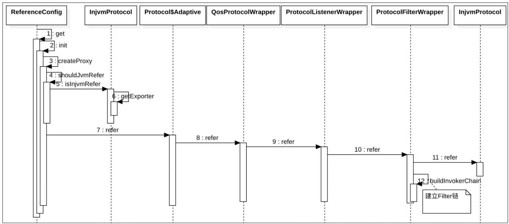

由图可知，消费端启动时会调用createProxy（）方法来创建代理：

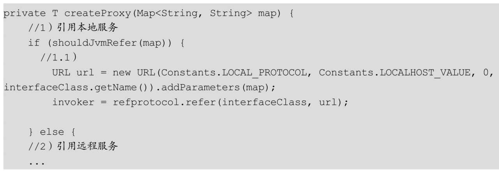

其中，由函数shouldJvmRefer（）决定是开启本地引用还是远程引用，然后其内部会调用InjvmProtocol的isInjvmRefer（）方法来进行判断，后者又会调用其getExporter（）方法从InjvmProtocol的缓存中查看是否有本地暴露的服务：

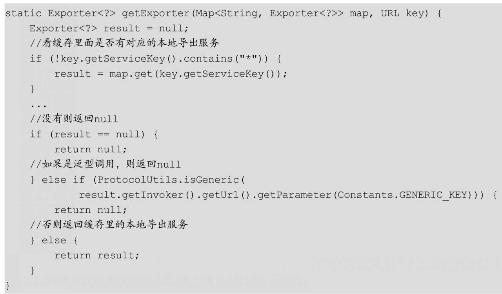

前面讲过，对应每个扩展接口，在整个JVM内只会有一个InjvmProtocol的实例，并且上一节我们介绍了在本地服务导出时会把导出的服务保存到InjvmProtocol的内部缓存exporterMap中，所以在同一JVM内进行本地引用时，可以根据服务key从exporterMap中找到导出的invoker并返回，所以代码1中的shouldJvmRefer（）方法会返回true。

执行代码1将创建一个本地URL，其中Host为127.0.0.1，Port为0，协议为injvm，这些参数与本地服务导出时一致。

装配好URL之后，调用refprotocol.refer（interfaceClass，url）进行服务引用，其中refprotocol为扩展接口。由于协议类型为injvm，因此这里会返回SPI中缓存的InjvmProtocol对象，并且该对象也是使用Wrapper包装后的，所以会经过一层层后才调用到InjvmProtocol的refer（）方法（如图12.4所示）。其refer（）方法的代码如下：
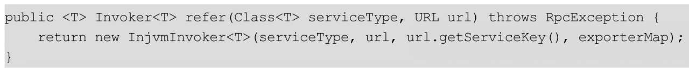

由代码可知，该方法返回了一个InjvmInvoker对象，并且保存了InjvmProtocol管理的exporterMap（其中保存了导出的本地服务）。

##本地服务一次引用流程
上面两节我们分别讲解了本地服务如何暴露、本地服务引用的启动流程，本节我们介绍一下发起一次本地引用调用的流程。这里以Provider模块中的APiConsumerInJvm为例画出时序图，如图12.5和图12.6所示：
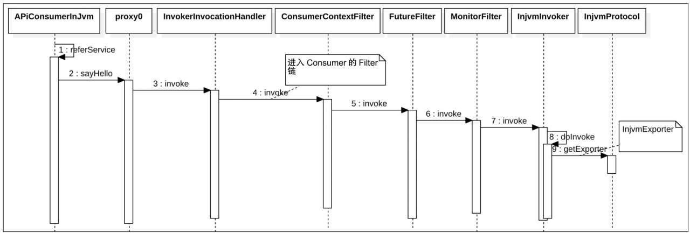
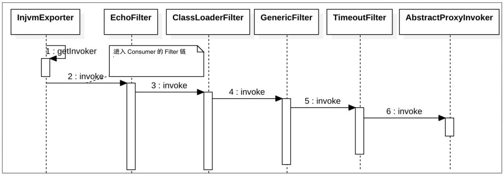

如图12.5所示，在发起本地调用后，会进入调用方的Filter链，并最终调用InjvmInvoker的invoke（）方法，其内部又从JVM内唯一的InjvmProtocol实例里获取导出服务对应的InjvmExporter实例，按照图12.6所示的时序，先进入本地服务提供方的Filter链，然后最终调用代理拦截器AbstractProxyInvoker的invoke（）方法以调用服务实现类的对应方法。

**总结：Dubbo本地服务发布与引用的原理，可知本地导出使用了injvm协议，这是一个伪协议，它不开启端口，不发起远程调用，只在JVM内直接关联，但执行Dubbo的Filter链。**