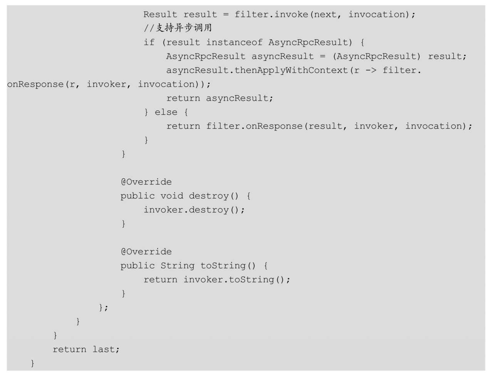
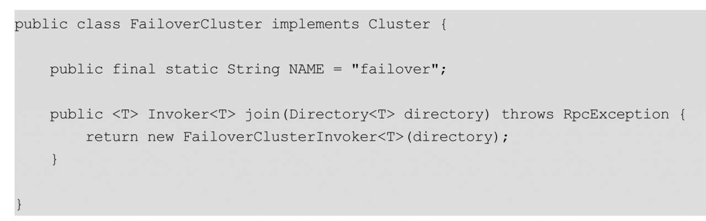

#远程服务发布与引用流程剖析
###1. Dubbo服务发布端启动流程剖析
   通过一个时序图，直观地看看Dubbo服务提供方启动的流程
   

服务提供方需要使用ServiceConfig API发布服务，具体来说就是执行图3.1中步骤1的export（）方法来激活发布服务。

export（）方法的核心代码如下：通过上面的代码可知，Dubbo的延迟发布是通过使用ScheduledExecutorService来实现的，可以通过调用ServiceConfig的setDelay（Integer delay）方法来设置延迟发布时间，其中shouldDelay（）方法的代码如下：

如果没有设置延迟时间，则直接调用doExport（）方法发布服务；如果设置了延迟发布，则等时间过期后调用doExport（）方法来发布服务。

如果使用MetadataReportConfig设置了元数据存储信息，代码5.2.3则将元数据保存到指定配置中心。在Dubbo 2.7.0中对服务元数据进行了改造，其把原来都保存到服务注册中心的元数据进行了分类存储，注册中心将只用于存储关键服务信息，比如服务提供者地址列表、完整的接口定义等。Dubbo 2.7.0使用更专业的配置中心，如Nacos、Apollo、Consul和Etcd等，提供更灵活、更丰富的配置规则，包括服务和应用不同粒度的配置、更丰富的路由规则和集中式管理的动态参数规则等。
另外，服务提供端导出服务具体使用的是下列代码：

其中，proxyFactory和protocol的定义为：

由此可知，proxyFactory和protocol都是扩展接口的适配器类。

执行代码proxyFactory.getInvoker（ref，（Class）interfaceClass，url）时，我们发现实际上是首先执行扩展接口ProxyFactory的适配器类ProxyFactory$Adaptive的getInvoker（）方法，其内部根据URL里的proxy的类型选择具体的代理工厂，这里默认proxy类型为javassist，所以又调用了JavassistProxyFactory的getInvoker（）方法获取了代理类。

JavassistProxyFactory的getInvoker（）方法的代码如下：

根据前面介绍的内容可知，_**这里首先把服务实现类转换为Wrapper类**_，是为了减少反射的调用，这里返回的是AbstractProxyInvoker对象，其内部重写doInvoke（）方法，并委托给Wrapper实现具体功能。到这里就完成了1.1中讲解的服务提供方实现类到Invoker的转换。
另外，当执行protocol.export（wrapperInvoker）方法的时候，实际调用了Protocol的适配器类Protocol$Adaptive的export（）方法。如果为远程服务暴露，则其内部根据URL中Protocol的类型为registry，会选择Protocol的实现类RegistryProtocol。如果为本地服务暴露，则其内部根据URL中Protocol的类型为injvm，会选择Protocol的实现类InjvmProtocol。但由于Dubbo SPI的扩展点使用了Wrapper自动增强，这里就使用了ProtocolFilterWrapper、ProtocolListenerWrapper、QosProtocolWrapper对其进行了增强，所以需要一层层调用才会调用到RegistryProtocol的export（）方法。本节我们只讲解远程服务暴露流程。

图3.1中步骤10的RegistryProtocol中的export（）方法通过步骤11的doLocalExport启动了NettyServer进行监听服务，步骤12、步骤13则将当前服务注册到服务注册中心。到这里就完成了2.2节中谈到的Invoker到Exporter的转换。

下面我们首先看看doLocalExport是如何启动NettyServer的。doLocalExport内部主要调用DubboProtocol的export（）方法，下面看看如图3.2所示的时序图:

从上图可以看到，在RegistryProtocol的doLocalExport（）方法内调用了Protocol的适配器类Protocol$Adaptive，这里URL内的协议类型是dubbo，所以返回的SPI扩展实现类是DubboProtocol，由于DubboProtocol也被Wrapper类增强了，所以也是一层层调用后，才执行到图3.2中的步骤8，即调用DubboProtocol的export（）方法。export（）方法的代码如下：

这里将Invoker转换为DubboExporter对象，并且把DubboExporter保存到了缓存exporterMap里（在服务提供方处理请求时会从中获取出来），然后执行图3.2中步骤10的openServer（）方法，其代码如下：

通过上面的代码可知，这里首先是获取当前机器地址信息（ip：port）并作为key，然后判断当前是否为服务提供端。如果是，则以此key为key查看缓存serverMap中是否有对应的Server，如果没有则调用createServer（）方法来创建，否则返回缓存中的value。由于每个机器的ip：port是唯一的，所以多个不同服务启动时只有第一个会被创建，后面的服务都是直接从缓存中返回的。

接着一步步会执行到如图3.3所示的时序图中的步骤7，即NettyTransporter的bind（）方法，这里由于Transporter是扩展接口，所以需要先经过其适配器类Transporter$Adaptive来根据URL里的参数做选择扩展实现。

在默认情况下，传输扩展实现选择的是Netty，而Netty对应的扩展实现为：

下面，我们看看NettyTransporter的bind（）方法，其代码如下：

NettyServer的构造函数代码如下：

在NettyServer的构造函数内部又调用了其父类AbstractServer的构造函数，后者构造函数的内容如下：

通过上面的代码可知，NettyServer的doOpen（）方法启动了服务监听，其中doOpen（）方法的代码如下：

至此，服务提供方的NettyServer已经启动了，这里需要注意是，将NettyServerHandler和编解码Handler注册到了每个接收链接的通道（channel）管理的管线中。

最后，我们看看在启动NettyServer后如何将服务注册到服务注册中心，这里我们使用ZooKeeper作为服务注册中心。接着上面的图3.1中步骤12的流程，我们先看看RegistryProtocol中export（）方法里的getRegistry（）方法是如何获取服务注册中心和注册服务的，首先看看如图3.4所示的时序图。

图3.4中的步骤2用来获取服务注册中心，其中RegistryFactory为扩展接口，所以这里通过适配器类来确定RegistryFactory的扩展实现为ZookeeperRegistryFactory，然后后者内部调用createRegistry（）方法创建了一个ZookeeperRegistry作为ZooKeeper注册中心。其中ZookeeperRegistry的getRegistry（）方法的代码如下：

在上图的步骤6中，register（）方法最终调用了zkClient的create（）方法将服务注册到ZooKeeper

服务注册到ZooKeeper后，ZooKeeper服务端的最终树图结构如图所示：

服务注册到ZooKeeper后，消费端就可以在Providers节点下找到com.books.dubbo.demo.api.GreetingService服务的所有服务提供者，然后根据设置的负载均衡策略选择机器进行远程调用了。

##2. Dubbo服务提供方如何处理请求
   当消费端发起TCP链接并完成后，在接收消费端发来的请求时，服务提供方是如何处理的，其处理时序图如图：
   

消费端发起TCP链接并完成后，服务提供方的NettyServer的connected方法会被激活，该方法的执行是在Netty的I/O线程上执行的，为了可以及时释放I/O线程，Netty默认的线程模型为All，正如在第7章所介绍的，所有消息都派发到Dubbo内部的业务线程池，这些消息包括请求事件、响应事件、连接事件、断开事件、心跳事件等，这里对应的是AllChannelHandler类把I/O线程接收到的所有消息包装为ChannelEventRunnable任务并都投递到了线程池里。

线程池里的任务被执行后，最终会调用DubboProtocol的connected（）方法，其代码如下：

其中，invoke（）是一个通用方法，其代码如下：

图3.6中的received部分（步骤12～步骤22）类似于connected，received事件被投递到线程池后进行异步处理。线程池任务被激活后调用了HeaderExchangeHandler的received（）方法，其代码如下：

如果请求不需要响应结果则直接调用DubboProtocol的received（）方法，否则执行handleRequest（）方法，后者代码如下：

如果请求需要返回值则执行handleRequest（）方法，其也是委托给DubboProtocol的reply（）方法来执行的。如果执行结果已经完成，则直接将结果写回消费端，否则使用异步回调方式（避免当前线程被阻塞），等执行完毕并拿到结果后再把结果写回消费端。

通过图3.6可知，无论消费端是否需要执行结果，最终都是DubboProtocol类的reply（）方法来执行具体的服务，下面我们看看reply（）方法的代码：

代码7首先使用getInvoker（）方法获取调用方法对应的DubboExporter对象导出的Invoker对象，具体代码如下。在3.1节中我们介绍了导出的DubboExporter对象会保存到exporterMap中，这里的getInvoker获取的是RegistryProtocol$InvokerDelegate：

代码8把对端的地址设置到上下文对象中。
代码9执行导出的Invoker的invoke（）方法，这里有个调用链，经过调用链后最终调用了服务提供方启动时AbstractProxyInvoker代理类创建的invoke（）方法，其调用时序如图3.7所示：

图3.7显示的是调用DubboProtocol的reply（）方法的情况，在调用InvokerDelegate的invoke（）方法前会先经过Filter链（这里只列出来了Filter链中的一部分Filter），然后InvokerDelegate会调用服务提供方启动时AbstractProxyInvoker代理类的invoke（）方法，其代码如下：

代码11获取上下文对象，代码11.1调用doInvoke（）方法，并使用JavaAssist来执行本地服务，以便减少反射调用，这里我们再回顾一下doInvoke（）方法的代码：

通过上面的代码可知，AbstractProxyInvoker的doInvoke（）方法委托Wrapper类的invokeMethod执行具体逻辑，后者则通过调用服务提供方接口的实现类来执行本地服务。

##3. Dubbo服务消费方启动流程剖析
   服务消费方启动流程时序图:
   

服务消费方需要使用ReferenceConfig API来消费服务，这里就是执行上图中步骤1的get（）方法来生成远程调用代理类。

get（）方法首先会执行init（）方法：其中，checkMock（）方法用来检查设置的mock是否正确（有关细节我们在第5章会展开讲解），然后通过调用createProxy（）方法来创建代理类，createProxy（）方法的核心代码如下：

上面的代码比较简单，首先判断是否需要开启本地引用，如果需要则创建JVM协议的本地引用，然后加载服务注册中心信息，服务注册中心可以有多个。

在2.2节我们讲过，服务暴露第一步是调用Protocol扩展接口实现类的refer（）方法以生成Invoker实例，这正是代码4做所的事情，其中refprotocol的定义如下：

从上面的代码可知，refprotocol是Protocol扩展接口的适配器类，这里调用的refprotocol.refer（interfaceClass，urls.get（0））；实际上是Protocol$Adaptive的refer（）方法。

在Protocol$Adaptive的refer（）方法内部，当我们设置了服务注册中心后，可以发现当前协议类型为registry，也就是说这里需要调用RegistryProtocol的refer（）方法。但RegistryProtocol被QosProtocolWrapper、ProtocolFilterWrapper、ProtocolListenerWrapper三个Wrapper类增强了，所以这里经过一层层调用后，最后才调用到RegistryProtocol的refer（）方法，其内部主要是调用了doRefer（）方法，doRefer（）方法的代码如下：

代码1根据订阅的URL创建路由规则链，代码2的作用是向服务注册中心订阅服务提供者的服务，代码3则是调用扩展接口Cluster的适配器类的join（）方法，根据参数选择配置的集群容错策略。这里我们先讲讲代码2的逻辑，看看Invoker是如何生成的，这里结合ZooKeeper作为服务注册中心来讲解，首先看看如图3.9所示的时序图：

图中的步骤2、步骤3和步骤4用来从ZooKeeper获取服务提供者的地址列表，等ZooKeeper返回地址列表后会调用RegistryDirectory的notify（）方法：

上面代码的notify（）方法内，对元数据信息进行了分类保存。

图3.9中的步骤6、步骤7和步骤8根据获取的最新的服务提供者URL地址，将其转换为具体的invoker列表，也就是说每个提供者的URL会被转换为一个Invoker对象，具体转换在toInvokers（）方法中进行：

从上面的代码可知，将服务接口转换到invoker对象是通过调用protocol.refer（serviceType，url）来完成的，这里的protocol对象也是Protocol扩展接口的适配器对象，所以调用protocol.refer实际上是调用适配器Protocol$Adaptive的refer（）方法。在URL中，协议默认为是Dubbo，所以适配器里调用的应该是DubboProtocol的refer（）方法。

前面的章节已讲过，Dubbo默认提供了一系列Wrapper类对扩展实现类进行功能增强，当然这里也不例外，Dubbo使用了ProtocolListenerWrapper、ProtocolFilterWrapper等类对DubboProtocol进行了功能增强。所以，在这里经过一次次调用后才调用到DubboProtocol的refer（）方法，DubboProtocol的refer（）方法的代码如下：

上面的代码可知，getClients（）方法创建服务消费端的NettyClient对象，其调用链的时序图如图3.10所示，其中NettyClient构造函数如下：

在ChannelHandlers.wrap函数内会确定消费端Dubbo内部的线程池模型，

NettyClient的父类AbstractClient的构造函数如下：

在上面的代码中，首先调用了NettyClient的doOpen（）方法：

上面的代码创建了一个启动NettyClient的bootstrap并对其进行设置，这里是把编解码器和自定义的nettyClientHandler添加到了链接Channel对应的管线里。

在调用doOpen（）方法后会调用NettyClient的doConnect（）方法与服务提供者建立TCP链接，其中NettyClient的doConnect（）方法的代码如下：

**这里需要注意三点：**

第一点，由于同一个服务提供者机器可以提供多个服务，那么消费者机器需要与同一个服务提供者机器提供的多个服务共享连接，还是与每个服务都建立一个连接？

第二点，消费端是启动时就与服务提供者机器建立好连接吗？

第三点，每个服务消费端与服务提供者集群中的所有机器都有连接吗？对于第三点，我们可以看看图3.9中的toRouters（）方法就可以找到答案，其内部是把具体服务的所有服务提供者的URL信息转换为了Invoker，也就是说服务消费端与服务提供者的所有机器都有连接。

为了回答上面的问题，我们看看getClients（）方法的代码：

**第一个问题回答**：通过上面的代码可知，在默认情况下当消费端引用同一个服务提供者机器上多个服务时，这些服务复用一个Netty连接。

下面我们从initClient（）方法里看第二个问题的答案：

**第二个问题回答**：上面的代码默认lazy为false，所以当消费端启动时就与提供者建立了连接。

另外，从DubboProtocol的refer（）方法可知，其内部返回了一个DubboInvoker，这就是原生的invoker对象，服务消费方远程服务转换就是为了这个invoker。图3.9中的步骤17则是对这个invoker进行装饰，即使用一系列Filter形成了责任链，invoker被放到责任链的末尾。下面我们看看ProtocolFilterWrapper的buildInvokerChain（）方法是如何形成责任链的，具体代码如下：

需要注意的是，消费端启动时并不是把所有的Filter扩展实现都放到责任链中，而是把group=consumer并且value值在URL里的才会放到责任链中，这一点在2.5节中提到过。

由于是责任链，所以ProtocolFilterWrapper的refer（）方法是将责任链头部的Filter返回到ProtocolListenerWrapper。

至此可知，在下图中，在RegistryDirectory里维护了所有服务者的invoker列表，消费端发起远程调用时就是根据集群容错和负载均衡算法以及路由规则从invoker列表里选择一个进行调用的，当服务提供者宕机的时候，ZooKeeper会通知更新这个invoker列表。

到这里，我们就讲完了图3.9中directory.subscribe（）方法是如何订阅服务提供者服务的，并且把服务提供者所有的URL信息转换为了invoker列表，并保存到RegistryDirectory里。下面，我们接着讲解图3.9中RegistryProtocol的doRefer（）方法中的cluster.join（directory）是如何使用集群容错扩展将Dubbo协议的invoker客户端转换为需要的接口的。在默认情况下，cluster的扩展接口实现为FailoverCluster，所以这里是调用FailoverCluster的join（）方法，FailoverCluster的join（）方法的代码如下：

这里是把directory对象包裹到了FailoverClusterInvoker里，需要注意的是，directory就是上面讲解的RegistryDirectory，其内部维护了所有服务提供者的invoker列表，而FailoverCluster就是集群容错策略。

其实，Dubbo对cluster扩展接口实现类使用Wrapper类MockClusterWrapper进行增强，

实际上调用的时序图如图3.12所示：

步骤3将FailbackClusterInvoker对象返回到步骤2，下面看看MockClusterWrapper类的代码：

从上面的代码可知，MockClusterWrapper类把FailoverClusterInvoker包装成了MockClusterInvoker实例，所以整个调用链最终调用返回的是MockClusterInvoker对象。也就是说，本节第一个时序图（见图3.8）中的步骤4返回的是MockClusterWrapper，然后执行图3.9中的步骤14以获取MockClusterInvoker的代理，这里默认调用的是JavassistProxyFactory的getProxy（）方法，其代码如下：

其中，InvokerInvocationHandler为具体拦截器。至此，我们按照逆序的方式把服务消费端启动流程讲解完了。

##4. Dubbo服务消费端一次远程调用过程
   先看看整体时序图:

   

我们提到服务消费端通过ReferenceConfig的get（）方法返回的是一个代理类，并且方法拦击器为InvokerInvocationHandler，所以当消费方调用了服务的接口方法后会被InvokerInvocationHandler拦截,

步骤2和步骤3调用了默认的集群容错策略FailoverClusterInvoker，其内部首先根据设置的负载均衡策略LoadBalance的扩展实现，选择一个invoker作为FailoverClusterInvoker具体的远程调用者，如果调用发生异常，则根据FailoverClusterInvoker的策略重新选择一个invoker进行调用。

在FailoverClusterInvoker内每次调用invoker的invoke（）方法时，都会走到步骤8和步骤9，后面的步骤10、步骤11和步骤12是在ProtocolFilterWrapper内创建的责任链，最后调用了原生的DubboInvoker，其使用NettyClient与服务提供者进行交互，其中DubboInvoker的doInvoke（）方法的内容如下：

从上面的代码可知，程序首先获取远程调用Client，然后判断调用是否为异步调用、是否请求响应。

如果请求不需要响应结果则直接使用远程Client发起请求调用，然后将RpcContext上下文的future设置为null，并且返回空的RpcResult。

如果请求是异步请求，则保存远程Client发起请求后返回的future对象，并且设置到RpcContext上下文中，这样，调用方就可以通过RpcContext上下文获取该future。

如果请求为同步请求，则首先设置RpcContext上下文中的future对象为null，然后使用远程Client发起请求，然后在返回的future对象上调用get（）方法，以同步等待远程调用结果的返回。